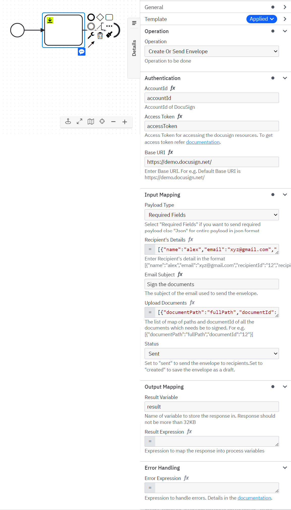
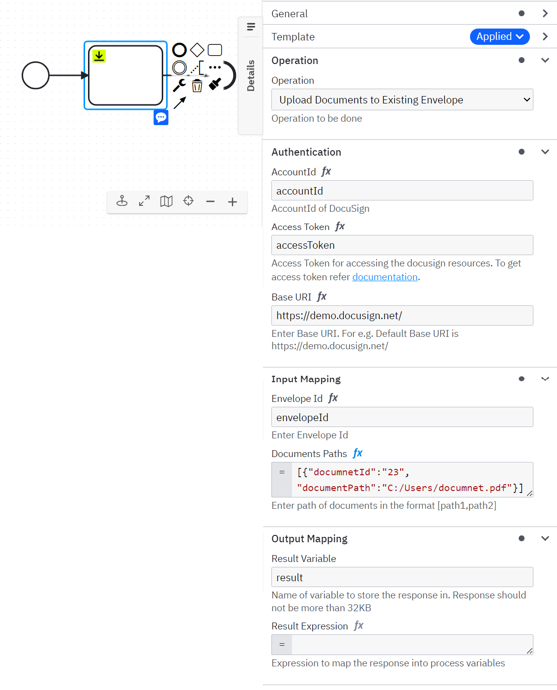
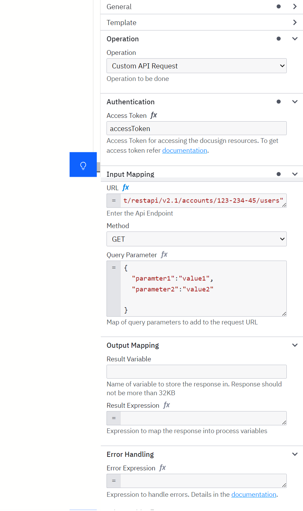

# Camunda DocuSign Connector

Find the user documentation [here](#documentation)

## Build

```bash
mvn clean package
```

## API

### Input

##### Authentication Details

```json
  {
  "authentication": {
    "accountId": "AccountId",
    "accessToken": "AccessToken",
    "baseUri": "https://demo.docusign.net/"
  },
  "operation": "docusign.addEnvelopeCustomeFields",
  "data": {
  }
}
```
In backend we are using Implicit grant as a Authentication method please [refer](https://developers.docusign.com/platform/auth/implicit/implicit-get-token/) this for getting access token
#### Input for Create Or Send Envelope

```json
{
  "authentication": {
    "accountId": "accountId",
    "accessToken": "accessToken",
    "baseUri": "https://demo.docusign.net/"
  },
  "operation": "docusign.createEnvelope",
  "data": {
    "payloadType": "requiredFields",
    "recipients": [
      {
        "name": "abc",
        "email": "abc@gmail.com",
        "recipientId": "12",
        "recipientType": "signers"
      },
      {
        "name": "abc",
        "email": "abc@gmail.com",
        "recipientId": "12",
        "recipientType": "carbonCopies"
      },
      {
        "name": "abc",
        "email": "abc@gmail.com",
        "recipientId": "12",
        "recipientType": "certifiedDeliveries"
      },
      {
        "name": "abc",
        "hostName": "abc@gmail.com",
        "hostEmail": "12",
        "recipientId": "inPersonSigners"
      }
    ],
    "emailSubject": "Email Subject",
    "status": "created",
    "documents": [
      {
        "documentPath": "C:/Users/abc/Contribution License Agreement.docx",
        "documentId": "12"
      }
    ]
  }
}
```


> **payloadType** can be requiredFields or json. If you select requiredFields then one needs to fill only minimum field for creating envelope or else you can add whole payload as json </br>
> **recipients** one can add recipients like signers, carbonCopies,certifiedDeliveries and inPersonsSigners. Just add signersType as one of the value mentioned earlier</br>
> **emailSubject** Enter the email subject</br>
> **status** status can be sent or created. **sent** will send the envelope and **created** will save it as a draft</br>
> **documents** Enter it as a list of map contains the field **documentPath** which is path of documents which is need to upload and **documentId** as id of the document.


#### Input for Get Envelope

```json
{
  "authentication": {
    "accountId": "accountId",
    "accessToken": "accessToken",
    "baseUri": "https://demo.docusign.net/"
  },
  "operation": "docusign.getEnvelope",
  "data": {
    "envelopeId": "123",
    "advanced_update": "true",
    "include": [
      "custom_fields",
      "documents"
    ]
  }
}
```


> **envelopeId** Enter the envvelopeId of an envelope which you want to fetch</br>
> **advanced_update** When true, envelope information can be added or modified.</br>
> **include** Specifies additional information about the envelope to return. Enter a comma-separated list, such as tabs,recipients. Valid values are:
>- custom_fields: The custom fields associated with the envelope.
>- documents: The documents associated with the envelope.
>- attachments: The attachments associated with the envelope.
>- extensions: The email settings associated with the envelope.
>- folders: The folder where the envelope exists.
>- recipients: The recipients associated with the envelope.
>- powerform: The PowerForms associated with the envelope.
>- tabs: The tabs associated with the envelope.
>- payment_tabs: The payment tabs associated with the envelope.
>- workflow: The workflow definition associated with the envelope.</br>

#### Input for Update Documents to existing envelope

```json
{
  "authentication": {
    "accountId": "accountId",
    "accessToken": "accessToken",
    "baseUri": "https://demo.docusign.net/"
  },
  "operation": "docusign.getEnvelope",
  "data": {
    "envelopeId": "123",
    "documents": [{"documentPath":"C:/users/user/documentId1","documentId": "12"}]
  }
}
```


> **envelopeId** Enter the envelopeId of an envelope which you want to fetch</br>
> **documents** Enter the list of map of documentPath and documentId.</br>

#### Input for Send Drafted Envelope

```json
{
  "authentication": {
    "accountId": "accountId",
    "accessToken": "accessToken",
    "baseUri": "https://demo.docusign.net/"
  },
  "operation": "docusign.getEnvelope",
  "data": {
    "envelopeId": "123"
  }
}
```


> **envelopeId** Enter the envelopeId of an envelope which you want to fetch</br>

#### Input for Search Envelopes

```json
{
  "authentication": {
    "accountId": "accountId",
    "accessToken": "accessToken",
    "baseUri": "https://demo.docusign.net/"
  },
  "operation": "docusign.getEnvelope",
  "data": {
    "to_date": "2022-05-09T21:56:12.2500000Z",
    "from_date": "2020-05-09T21:56:12.2500000Z",
    "user_id": "userId",
    "folder_types": "inbox",
    "envelopeIds": ["123","124","1234"],
    "user_name": "userName",
    "email": "abc@gmail.com",
    "count": "12",
    "extraFields": [{"query_budget": "12"}],
    "include": ["documents","attachments"],
    "search_text": "demo",
    "order": "asc",
    "order_by": "last_modified",
    "status": "completed"

  }
}
```

> **envelopeId** Enter the envelopeId of an envelope which you want to fetch</br>
> **user_id** The ID of the user who created the envelopes to be retrieved. Note that an account can have multiple users, and any user with account access can retrieve envelopes by user_id from the account.</br>
> **folder_types** A comma-separated list of folder types you want to retrieve envelopes from. Valid values are:
normal, inbox ,sentitems, draft ,templates</br>
> **envelopeIds** Comma separated list of envelopeId values.</br>
> **user_name** Limit results to envelopes sent by the account user with this user name.
email must be given as well, and both email and user_name must refer to an existing account user.</br>
> **email** Limit results to envelopes sent by the account user with this email address.
user_name must be given as well, and both email and user_name must refer to an existing account user.</br>
> **count** Limit results to envelopes sent by the account user with this email address.
user_name must be given as well, and both email and user_name must refer to an existing account user.</br>
> **include**: Specifies additional information to return about the envelopes. Use a comma-separated list, such as folders, recipients to specify information. Valid values are:
> custom_fields: The custom fields associated with the envelope.</br>
> documents: The documents associated with the envelope.</br>
> attachments: The attachments associated with the envelope.</br>
> extensions: Information about the email settings associated with the envelope.</br>
> folders: The folders where the envelope exists.</br>
> recipients: The recipients associated with the envelope.</br>
> payment_tabs: The payment tabs associated with the envelope. </br>
> **extraFields**: </br>
> **search_text** Free text search criteria that you can use to filter the list of envelopes that is returned.</br>
> **order**: Returns envelopes in either ascending (asc) or descending (desc) order.</br>
> **order_by**: Sorts results according to a specific property. Valid values are:
last_modified,
action_required,
created,
completed,
envelope_name,
expire,
sent,
signer_list,
status,
subject,
user_name,
status_changed,
last_modified</br>
> **status**: A comma-separated list of current envelope statuses to included in the response. Possible values are:
completed,
created,
declined,
deleted,
delivered,
processing,
sent,
signed,
timedout,
voided.</br>
> **to_date**: Specifies the date and time to stop looking for status changes. The default is the current date and time.
Although you can use any date format supported by the .NET system library's DateTime.Parse() function, DocuSign recommends using ISO 8601 format dates with an explicit time zone offset If you do not provide a time zone offset, the method uses the server's time zone.
For example, the following dates and times refer to the same instant:
>>2017-05-02T01:44Z</br>
>>2017-05-01T21:44-04:00</br>
>>2017-05-01T18:44-07:00</br>
>
> **from_date** Specifies the date and time to start looking for status changes. This parameter is required unless envelopeIds or transactionIds are set.Although you can use any date format supported by the .NET system library's DateTime.Parse() function, DocuSign recommends using ISO 8601 format dates with an explicit time zone offset If you do not provide a time zone offset, the method uses the server's time zone.
For example, the following dates and times refer to the same instant:
>>- 2017-05-02T01:44Z</br>
>>- 2017-05-01T21:44-04:00
>>- 2017-05-01T18:44-07:00</br>


#### Input for Add Recipients To Envelope


```json
  {
    "authentication": {
      "accountId": "accountId",
      "accessToken": "accessToken",
      "baseUri": "https://localhost:8080"
    },
    "operation": "docusign.addRecipientsToEnvelope",
    "data": {
      "envelopeId": "123",
      "resend_envelope": "true",
      "payloadType": "requiredRecipients",
      "signers": [
        {
          "email": "abc@gmail.com",
          "name":"abc",
          "recipientId":"12"
        }
      ],
      "certifiedDelivery": [
        {
          "email": "abc@gmail.com",
          "name":"abc",
          "recipientId":"12"
        }
      ],
      "inPersonSigners": [
        {
          "name": "abc",
          "hostName":"hostName",
          "hostEmail":"hostEmail@gmail.com"
        }
      ],
      "carbonCopies": [
        {
          "email": "abc@gmail.com",
          "name":"abc",
          "recipientId":"12"
        }
      ]
    }
  }
```

#### Input for Add Custom Fields To Envelope


```json
  {
  "authentication": {
    "accountId": "accountId",
    "accessToken": "accessToken",
    "baseUri": "https://localhost:8080"
  },
  "operation": "docusign.addEnvelopeCustomeFields",
  "data": {
    "envelopeId": "123",
    "textFields": [
      {
        "fieldId": "12",
        "name": "textCustomField",
        "required": "true",
        "show": "true",
        "value": "customFieldValue"
      }
    ],
    "listFields": [
      {
        "fieldId": "13",
        "listitems": [
          "item1",
          "item2"
        ],
        "name": "listCustomField",
        "required": "true",
        "show": "true",
        "value": "customField"
      }
    ]
  }
}
```
>**envelopeId** Enter envelopeId </br>
> **fieldId** Enter the fieldId </br>
> **name** The name of the custom field</br>
> **required** When true, senders are required to select an option from the list before they can send the envelope.</br>
> **show** When true, the field displays in the Envelope Custom Fields section when a user creates or sends an envelope.</br>
> **value** The value of the custom field. This is the value that the user who creates or sends the envelope selects from the list.</br>
> **listItems** An array of strings that represents the options in a list.</br>

#### Input for Download Documents From Envelope


```json
  {
  "authentication": {
    "accountId": "accountId",
    "accessToken": "accessToken",
    "baseUri": "https://localhost:8080"
  },
  "operation": "docusign.downloadDocumentsFromEnvelope",
  "data": {
    "envelopeId": "123",
    "documentId": "12",
    "path": "C:/Users/user/document_name",
    "documentName": "downloaded_documents",
    "certificate": "true",
    "showChanges": "true",
    "language": "en"
  }
}
```
> **envelopeId**: "Enter the envelopeId"</br>
> **documentId**: "The ID of the document to retrieve. Alternatively, you can use one of the following special keywords:</br>
>>- combined: Retrieves all of the documents as a single PDF file. When the query parameter certificate is true, the certificate of completion is included in the PDF file. When the query parameter certificate is false, the certificate of completion is not included in the PDF file.</br>
>>- archive: Retrieves a ZIP archive that contains all of the PDF documents and the certificate of completion.</br>
>>- certificate: Retrieves only the certificate of completion as a PDF file.</br>
>>- portfolio: Retrieves the envelope documents as a PDF portfolio.",</br>
>
> **path**: "Where to store the documents"</br>
> **documentName**: "Name of the downloaded documents"</br>
> **certificate**: "Used only when the documentId parameter is the special keyword combined.</br>
When true, the certificate of completion is included in the combined PDF file. When false, (the default) the certificate of completion is not included in the combined PDF file"</br>
> **showChanges**: "When true, any changed fields for the returned PDF are highlighted in yellow and optional signatures or initials outlined in red. The account must have the Highlight Data Changes feature enabled.",</br>
> **language**: "Specifies the language for the Certificate of Completion in the response. The supported languages are: Chinese Simplified (zh_CN), Chinese Traditional (zh_TW), Dutch (nl), English US (en), French (fr), German (de), Italian (it), Japanese (ja), Korean (ko), Portuguese (pt), Portuguese (Brazil) (pt_BR), Russian (ru), Spanish (es)."</br>

#### Input for Create Users

```json
  {
  "authentication": {
    "accountId": "accountId",
    "accessToken": "accessToken",
    "baseUri": "https://localhost:8080"
  },
  "operation": "docusign.createUsers",
  "data": {
    "payload": {
      "newUsers": [
        {
          "userName": "Claire Horace",
          "email": "claire@example.com"
        },
        {
          "userName": "Tal Mason",
          "email": "talmason@example.com",
          "company": "TeleSel",
          "userSettings": {
            "locale": "fr",
            "canSendEnvelope": true
          }
        }
      ]
    }
  }
}
```
> **payload**:Enter the payload in json format. [visit](https://developers.docusign.com/docs/esign-rest-api/reference/users/users/create/#schema__newusersdefinition) for more reference

#### Input for Add Users to groups

With userIds as payloadType
```json
  {
  "authentication": {
    "accountId": "accountId",
    "accessToken": "accessToken",
    "baseUri": "https://localhost:8080"
  },
  "operation": "docusign.addUsersToGroup",
  "data": {
    "payloadType": "userIds",
    "userIds": ["12","123"],
    "groupId": "grpId"
  }
}
```
With entirePayload as payloadType
```json
  {
  "authentication": {
    "accountId": "accountId",
    "accessToken": "accessToken",
    "baseUri": "https://localhost:8080"
  },
  "operation": "docusign.addUsersToGroup",
  "data": {
    "payloadType": "entirePayload",
    "payload": {
      "users": [
        {
          "accountName": "accoutName",
          "email": "abc@gmail.com",
          "ipAddress": "ipAddress",
          "loginStatus": "loginStatus",
          "userId": "12",
          "userName": "abc",
          "userStatus": "Active",
          "userType": "CompanyUser"
        }
      ]
    }
  }
}
```
for more information about payload [visit](https://developers.docusign.com/docs/esign-rest-api/reference/usergroups/groupusers/update/).


#### Input for Custom Api Request

```json
  {
  "authentication": {
    "accessToken": "accessToken"
  },
  "operation": "docusign.customApiRequest",
  "data": {
    "url": "https://demo.docusign.net/restapi/v2.1/accounts/{accountId}/users",
    "method": "delete",
    "queryParameter": {"delete": "Groups,PermissionSet,SigningGroupEmail","anotherParameter": "anotherParameter"},
    "payload": {
      "users": [
        {
                "accountName": "accountName",
                "activationAccessCode": "AccessCode",
                "email": "abc@gmail.com",
                "ipAddress": "iPAddess",
                "loginStatus": "loginStatus",
                "membershipId": "membershipId"
        }
      ]
    }
  }
}
```


### Output

```json
{
  "result": {
    "response": "....."
  }
}
```
# **Documentation**

**Docusign** – DocuSign enables you to electronically send and sign documents, conveniently and securely from any computer or mobile device.
</br>
The Docusign Connector can be used for performing various kind of operations using templates from your BPMN process like creating and sending the envelope for signing.


### **Prerequisites**

To start working with the Docusign Connector. user need details like - accountId, accessToken,baseUri.

*The following parameters are necessary for establishing connection* -

-	**accountId**- Account Id of docusign.
-	**accessToken**: accessToken for making an request. [refer](https://developers.docusign.com/platform/auth/implicit/implicit-get-token/) this for getting an accessToken
-	**baseUri**: baseUri 

### **Creating Docusign connector task**

Currently, the Docusign Connector supports 20 types of operations: Create and Send the envelope, get envelope, Add user to accounts etc.
To use a Docusign Connector in your process, either change the type of existing task by clicking on it and using the wrench-shaped **Change type** context menu icon or create a new Connector task by using the **Append Connector** context menu. Follow our [guide on using Connectors](https://docs.camunda.io/docs/components/connectors/use-connectors/) to learn more.

### **Making Docusign Connector executable**

To make the Docusign Connector executable, fill out the mandatory fields highlighted in red in the properties panel.

### **Authentication for Docusign Connector**

SFTP Connector authentication object takes – **accountId**, **accessToken**, **baseUri** 

## **Create Or Send Envelope**



> **To Create or Send envelope, take the following steps:**
1.	In the ***Operation** section*, set the field value *Operation* as **Create or Send envelope**.
2.	Set the required parameters and credentials in the **Authentication** section.
3.	In the **Input Mapping** section, set the payloadType,recipients,emailSubject,status and documents .
4.  **payloadType** can be requiredFields or json. If you select requiredFields then one needs to fill only minimum field for creating envelope or else you can add whole payload as json </br>
5.  **recipients** one can add recipients like signers, carbonCopies,certifiedDeliveries and inPersonsSigners. Just add signersType as one of the value mentioned earlier</br>
6.  **emailSubject** Enter the email subject</br>
7.  **status** status can be sent or created. **sent** will send the envelope and **created** will save it as a draft</br>
8.  **documents** Enter it as a list of map contains the field **documentPath** which is path of documents which is need to upload and **documentId** as id of the document.

8. Set **recipients**, using FEEL expression as list of context.
   e.g.
    ```json
   [
    {
      "name":"alex",
      "email":"alex@gmail.com",
      "recipientId": "12",
      "recipientType": "signers"
    },
   {
      "name":"bob",
      "email":"bob@gmail.com",
      "recipientId": "13",
      "recipientType": "carbonCopies"
    },
   {
      "name":"alex",
      "email":"alex@gmail.com",
      "recipientId": "12",
      "recipientType": "certifiedDeliveries"
    },
    {
      "name":"alex",
      "email":"alex@gmail.com",
      "recipientId": "12",
      "recipientType": "inPersonSigners"
    }
   ]
    ```
   For recipientType key different values can be used like carbonCopies,certifiedDeliveries,inPersonSigners and signers </br>


> **Send or Create Envelope operation response**

You can use an output mapping to map the response:
- Use **Result Variable** to store the response in a process variable. 

## **Upload Documents To Existing Envelope**



> **To Upload Documents To Existing Envelope, take the following steps:**
1.	In the ***Operation** section*, set the field value *Operation* as **Upload Documents To Existing Envelope**.
2.	Set the required parameters and credentials in the **Authentication** section.
3.	In the **Input Mapping** section, set the field envelopeId,documents.
4.  **envelopeId** enter envelopeId in which you need to upload the documents
5. Set **documnets**, using FEEL expression as list of context.
   e.g.
    ```json
    {
      "documentId":"12",
      "documentPath":"C:/Users/userDocument.pdf"
    }
    ```
   
> **Upload Documents To Existing Envelope operation response**

You can use an output mapping to map the response:
- Use **Result Variable** to store the response in a process variable name, size, parent, path, etc.

## **Custom Api Request**



> **To Move File, take the following steps:**
1.	In the ***Operation** section*, set the field value *Operation* as **Custom Api Request**.
2.	Set the required parameters and credentials in the **Authentication** section.
3.	In the **Input Mapping** section, set the field **url**, **method**, **queryParameter** and **payload**".
4.	Set **url**, which is basically full rest endpoint like 
      e.g. ```https://demo.docusign.net/restapi/v2.1/accounts/123-345-67234/users```


> **Custom Api Request operation response**

You can use an output mapping to map the response:
-	Use **Result Variable** to store the response in a process variable.

## **Custom Api Request**


> **To Move Folder, take the following steps:**
1.	In the ***Operation** section*, set the field value *Operation* as **Move Folder**.
2.	Set the required parameters and credentials in the **Authentication** section.
3.	In the **Input Mapping** section, set the field **sourceDirectory**, **targetDirectory**, **Action if Folder Exists**".
4.	Set **sourceDirectory**, which is basically a path of folder which will be moved.
      e.g. ```C:/Users/user/Documents/sourceFolder/demoFolder```
5. Set **targetDirectory**, which is basically a path of folder where folder is going to moved. If it does not exists then connector will create a targetDirectory.
6. Set "Action If Folder Exists" as "rename", "replace" or "skip". This operations are performed when the folder is already exists in a target folder.
   </br> If **rename** is selected  then it will rename a folder.
   </br>  If **replace** is selected then it will replace a folder.
   </br> if **skip** is selected then it will skip this operation/folder.


## Test locally

Run unit tests

```bash
mvn clean verify
```

### Test as local Job Worker

Use
the [Camunda Connector Runtime](https://github.com/camunda-community-hub/spring-zeebe/tree/master/connector-runtime#building-connector-runtime-bundles)
to run your function as a local Job Worker.

See also the [:lock:Camunda Cloud Connector Run-Time](https://github.com/camunda/connector-runtime-cloud)

## Element Template

The element templates can be found in
the [docusign-connector.json](./element-templates/docusign-connector.json) file.


# **Appendix & FAQ**

### **How can I authenticate Docusign Connector?**

The Docusign Connector needs the credentials for connection except Custom Api Requests -
-	**accountId**- Account Id of your account
-	**accessToken**: [refer](https://developers.docusign.com/platform/auth/implicit/implicit-get-token/) this to generate accessToken
-	**baseUri** : A base path for the authentication service. This path differs depending on whether your app is in the developer environment or in production.
     For the developer environment, the base URI is
     https://account-d.docusign.com/oauth/auth
     For the production environment, the base URI is
     https://account.docusign.com/oauth/auth

### **What is url in Custom Api Requests?**
    It is full rest endpoint to which you want to send request to. Enter all the required details like accountId,envelopeId as neccessary.

