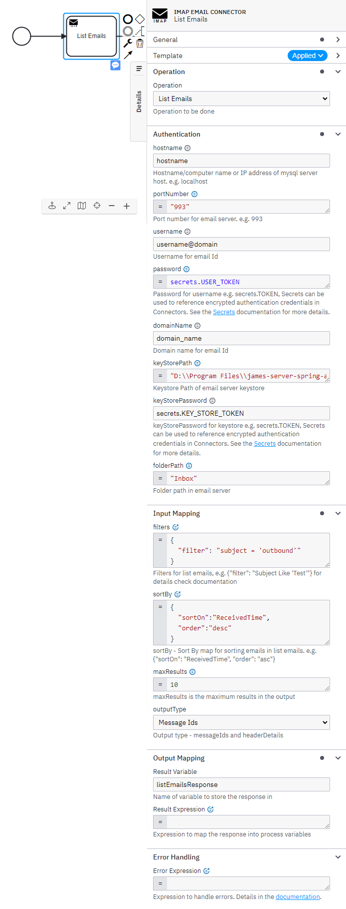
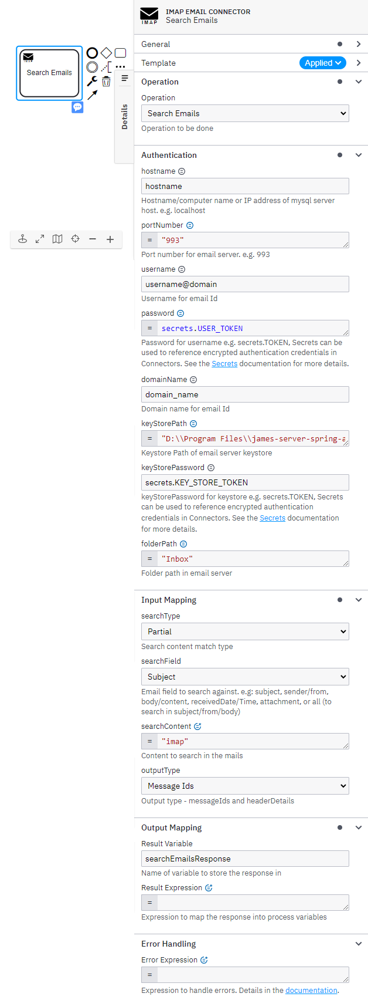
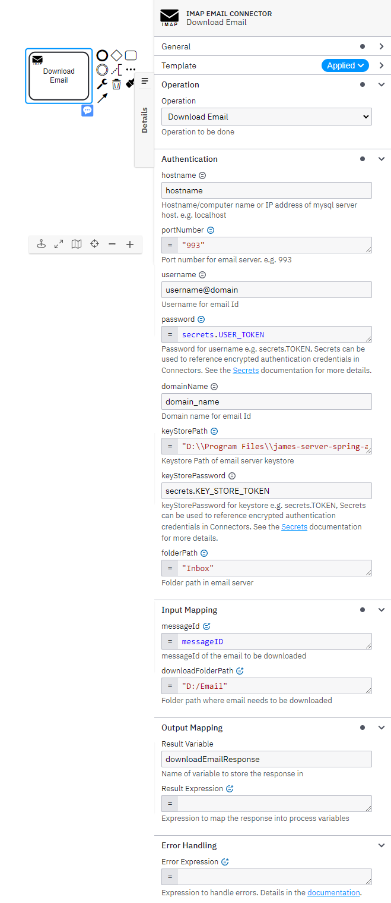
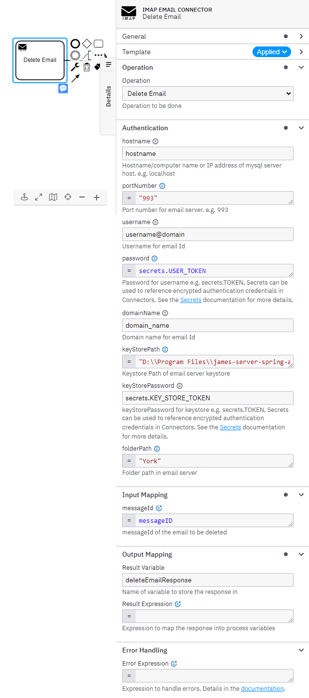
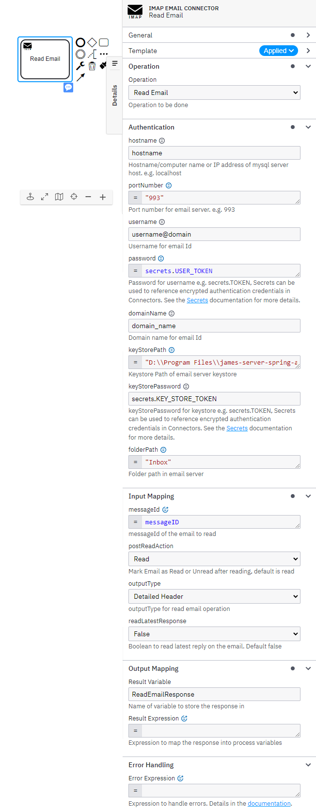
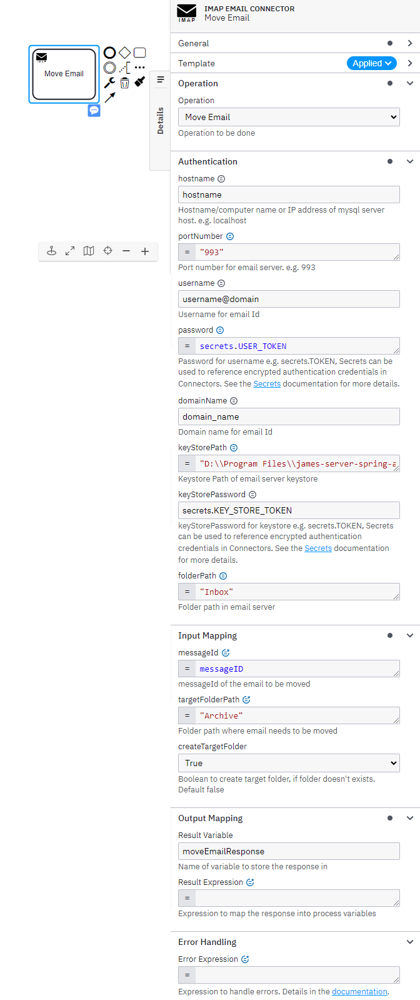

# Camunda IMAP Email Connector

Find the user documentation [here](#documentation)

## Build

```bash
mvn clean package
```

## API

### Input

##### Authentication Details

```json
{
  "authentication": {
    "hostname": "HOSTNAME",
    "portNumber": "993",
    "username": "USERNAME",
    "password": "secrets.MY_SECRET",
    "domainName": "DOMAIN_NAME",
    "keyStorePath": "KEYSTORE_PATH",
    "keyStorePassword": "secrets.KEYSTORE_PASSWORD",
    "folderPath": "<FOLDER_PATH>"
  },
  "operation": "",
  "data": {}
}
```

#### Input for Delete Email

```json
{
  "authentication": {},
  "operation": "imap.delete-email",
  "data": {
    "messageId": "MESSAGE_ID"
  }
}
```

#### Input for Download Email

```json
{
  "authentication": {},
  "operation": "imap.download-email",
  "data": {
    "messageId": "MESSAGE_ID",
    "downloadFolderPath": "D:/Email/EMLFile"
  }
}
```

#### Input for List Emails

```json
{
  "authentication": {},
  "operation": "imap.list-emails",
  "data": {
    "filters": {
      "filter": "Subject = 'Test Email'"
    },
    "sortBy": {
      "sortOn": "ReceivedTime",
      "order": "asc"
    },
    "maxResults": 100,
    "outputType": "headerDetails"
  }
}
```

> **maxResults** is the maximum number of records in output.</br>
> **outputType** it can be  "headerDetails" or "messageIds".</br>
> **filters** is a map with keys - filter, filterList and logicalOperator. It will be used to create *SearchTerm* for
> search messages.</br>
> The value for *filter* key is string with space separated - searchField, operator and value. If value is string or
> date, wrap it in single quote.</br>
</br>
> searchField can be - "size","flag","body","from","header","subject","recipient","messageNumber","messageId","
> sentDate", and "receivedDate"</br>
</br>
> Date String should be in format - "dd/MM/yyyy hh:mm:ss a","dd/MM/yyyy HH:mm:ss","dd/MM/yyyy","E MMM dd HH:mm:ss Z
> yyyy","EEEE MMMM d yyyy","MMMM d yyyy","yyyy-MM-dd HH:mm:ss","yyyy-MM-d HH:mm:ss","yyyy-MM-dd","dd MMM yyyy"</br>
</br>
> For complex filter ( more than one condition ) logicalOperator and filterList must co-exist.</br>

> ***Examples :***</br>
> **1. Simple filter **↴****</br>

```json
{
  "filter": "subject = 'Test Email'"
}
```

> {"filter": "subject = 'Test Email'"} -> *Search for emails containing Test Email as sub-string* <br>
> {"filter", "Flag seen true"} -> *Search for emails with Flag.SEEN marked as true* <br>
> {"filter", "ReceivedTime >= '11/07/2023 12:01:00 AM'"} -> *Search for emails with ReceivedTime greater than equal to
this date* <br>
> {"filter", "ReceivedTime < '14/07/2023 12:01:00 AM'"} -> *Search for emails with ReceivedTime less than this
date* <br>
> {"filter": "body contains 'this string'"} -> *Search for emails whose body contains 'this string'* <br>
> {"filter": "from = 'dev@xyz.com'"} -> *Search for emails with Flag.SEEN marked as true* <br>
> {"filter": "size >= 91801"} -> *Search for emails with size greater than or equal to 91801 bytes* <br>

> **2. Simple filter with negation **↴****</br>

```json
{
  "filter": "recipient cc 'test@xyz.com'",
  "logicalOperator": "NOT"
}
```

> **3. Complex filter **↴****</br>

```json
{
  "logicalOperator": "AND",
  "filterList": [
    {
      "filter": "body 'this string'"
    },
    {
      "filter": "from = 'dev@xyz.com'"
    },
    {
      "filter": "size >= 91801"
    }
  ]
}
```

> **sortBy** is a maps with keys - sortOn and order. For sorting the list of messages, based on ( *sortOn* )- size,
> from, subject, message number, messageID, sent date or received date</br>
> ***Example :***</br>

```json
{
  "sortOn": "receivedDate",
  "order": "desc"
}
```

#### Input for Move Email

```json
{
  "authentication": {},
  "operation": "imap.move-email",
  "data": {
    "messageId": "MESSAGE_ID",
    "targetFolderPath": "Junk Emails",
    "createTargetFolder": false
  }
}
```

#### Input for Read Email

```json
{
  "authentication": {},
  "operation": "imap.read-email",
  "data": {
    "messageId": "MESSAGE_ID",
    "postReadAction": "read",
    "outputType": "detailedHeader",
    "readLatestResponse": false
  }
}
```

> **outputType** "detailedHeader" or "header"

#### Input for Search Emails

```json
{
  "authentication": {},
  "operation": "imap.search-emails",
  "data": {
    "searchType": "complete",
    "searchField": "subject",
    "searchContent": "Test Email",
    "outputType": "headerDetails"
  }
}
```

> **searchType**   "complete" or "partial".</br>
> **searchField** it can be  "subject", "sender", "from", "body", "receivedDate", "receivedTime", or "attachment".</br>
> **searchContent** content to match against the search field.</br>
> **outputType** it can be  "headerDetails" or "messageIds".</br>

### Output

```json
{
  "result": {
    "response": "....."
  }
}
```

## Test locally

Run unit tests

```bash
mvn clean verify
```

### Test as local Job Worker

Use
the [Camunda Connector Runtime](https://github.com/camunda-community-hub/spring-zeebe/tree/master/connector-runtime#building-connector-runtime-bundles)
to run your function as a local Job Worker.

See also the [:lock:Camunda Cloud Connector Run-Time](https://github.com/camunda/connector-runtime-cloud)

## Element Template

The element templates can be found in
the [imap-email-connector.json](element-templates/imap-email-connector.json) file.

# **Documentation**

**IMAP** – *Internet Mail Access Protocol*. It is an application-layer Internet standard protocol used by e-mail clients to retrieve e-mail from a mail server.  
The IMAP Connector can be used for performing various kind of email operations using templates from your BPMN process.


### **Prerequisites**

To start working with the IMAP Connector. user need an email server details like - hostname, portNumber, username, password, domainName, keyStorePath and keyStorePassword and folderPath.

*The following parameters are necessary for establishing connection* -  

-	**hostname**- A hostname is a distinct name or label assigned to any device connected to a computer network, in this case its location where email server is hosted.
-	**portNumber**: Port Number of IMAP server
-	**username** and **password**: Username and password of user with required privilege.
-	**domainName**: will be used if username doesn't contain domain name.
-	**keyStorePath**: Path for Email Server's Keystore - **Optional** *( if required )*
-	**keyStorePassword**: Email Server's Keystore password - **Optional** *( if keyStorePath is provided )*
- **folderPath**: An email folder is a collection of email messages, not a file. You can create folders to organize emails, move messages, and add folders to your Favorites folder for easy access. e.g. ***Inbox, Sent Items, or it can be custome folders with sub directory i.e Inbox/Stocks***

### **Creating IMAP connector task**  

Currently, the IMAP Connector supports six types of operations: list emails, search emails, delete email, download email, read email and move email.

To use a IMAP Connector in your process, either change the type of existing task by clicking on it and using the wrench-shaped **Change type** context menu icon or create a new Connector task by using the **Append Connector** context menu. Follow our [guide on using Connectors](https://docs.camunda.io/docs/components/connectors/use-connectors/) to learn more.

### **Making IMAP Connector executable**  

To make the IMAP Connector executable, fill out the mandatory fields highlighted in red in the properties panel.

### **Authentication for IMAP Connector**  

IMAP Connector authentication object takes – **hostname**, **portNumber**, **username** and **password** *(as secrets Token i.e. secrets.Token)*, **domainName**, **keyStorePath**, **keyStorePassword** *(as secrets Token e.g. secrets.Token)*, **folderPath**.


## **List Emails**



> **To alter table, take the following steps:**
1.	In the ***Operation** section*, set the field value *Operation* as **List Emails**.
2.	Set the required parameters and credentials in the **Authentication** section.
3.	In the **Input Mapping** section, set the field filters, sortBy, maxResults and outputType as the desired. You must use FEEL expression for filters and sortBy.
4.	Set [**filters**](#what-is-filters-input-parameter), using FEEL expression as context with keys as - filter, logicalOperator & filterList. 
    > e.g. Search for emails containing "Subject SubString" as a substring.
    ```json
    {
        "filter": "subject = 'Subject SubString'"
    }
    ```
    It will be used to create **SearchTerm**. The value for filter key is string with space separated –searchFeild, operator and value. If value is string or date, wrap it in single quote.

7. Set [**sortBy**](#what-is-sortby-input-parameter), using FEEL expression as list of context with keys – sortOn and order.
    e.g. 
    ```json
    {
      "sortOn":"ReceivedTime",
      "order":"desc"
    }
    ```
    For sortOn key different values can be used like size, from, subject, message number, messageID, sent date or received date. For order key use "asc” or “dsc” which sort according to ascending and descending order.

8.	**maxResults** is maximum number of records in output

9.	**outputType** can be selected as **Message Ids** or **Header Details** as per requirements.

<br>

> **List Emails operation response**

You can use an output mapping to map the response:
- Use **Result Variable** to store the response in a process variable. Response is based on what one selects in outputType i.e. messageIds or headerDetails. Message Ids - List of email message ids.
headerDetails - List of maps of email header information related to - subject, size, received date etc.

## **Serach Emails**



> **To alter table, take the following steps:**
1.	In the ***Operation** section*, set the field value *Operation* as **Search Emails**.
2.	Set the required parameters and credentials in the **Authentication** section.
3.	In the **Input Mapping** section, set the field **searchType, searchField, searchContent** and **outputType** as the desired. FEEL expression is required for searchField, searchContent.
4. **searchType** it can be partial or complete. Match type of serachContent against searchField value.
5.	**searchField** should contain email field to search against. E.g. Subject, From Address, Body, Attachment or all (will search in all fields)
6.	**searchContent** should contain content one is looking for in particular searchField.
7.	**outputType** can be selected as **Message Ids** or **Header Details** as per requirements.

<br>

> **Search Emails operation response**

You can use an output mapping to map the response:
- Use **Result Variable** to store the response in a process variable. Response is based on what one selects in outputType i.e. messageIds or headerDetails. Message Ids - List of email message ids.
headerDetails - List of maps of email header information related to - subject, size, received date etc.

## **Download Email**



> **To alter table, take the following steps:**
1.	In the ***Operation** section*, set the field value *Operation* as **Download Email**.
2.	Set the required parameters and credentials in the **Authentication** section.
3.	In the **Input Mapping** section, set the field **messageId**, **downloadFolderPath**.
4.	Set **messageId**, which is unique message id of the email.  
e.g. ```<37447564.88583@abc.com>```
5.	Set **downloadFolderPath**, where email will be downloaded as **subject.eml** file.

<br>

> **Download Email operation response**

You can use an output mapping to map the response:
-	Use **Result Variable** to store the response in a process variable.

## **Delete Email**



> **To alter table, take the following steps:**
1.	In the ***Operation** section*, set the field value *Operation* as **Delete Email**.
2.	Set the required parameters and credentials in the **Authentication** section.
3.	In the **Input Mapping** section, set the field **messageId**.
4.	Set **messageId**, which is unique message id of the email.  
e.g. ```<37447564.88583@abc.com>```

<br>

> **Delete Email operation response**

You can use an output mapping to map the response:
-	Use **Result Variable** to store the response in a process variable.

## **Read Email**



> **To alter table, take the following steps:**
1.	In the ***Operation** section*, set the field value *Operation* as **Read Email**.
2.	Set the required parameters and credentials in the **Authentication** section.
3.	In the **Input Mapping** section, set the field **messageId**, **ReadFolderPath**.
4.	Set **messageId**, which is unique message id of the email.  
e.g. ```<37447564.88583@abc.com>```
5.	Set **postReadAction**, mark email as **Read** or Left it as **Unread** after reading email.
6. Set **outputType**,  map with keys -  
**Header** - *SenderEmailAddress,ToList,CcList,BccList,Subject,Size,ReceivedDate*
**Detailed Header** - *SenderEmailAddress,ToList,CcList,BccList,Subject,Size,ReceivedDate, PlainContent, HtmlContent, AttachmentsCount, AttachmentDetails*  
7. Set **readLatestResponse**, if true it will read  the latest reply of the email. Default false, will read complete email body. 
<br>

> **Read Email operation response**

You can use an output mapping to map the response:
-	Use **Result Variable** to store the response in a process variable.

## **Move Email**



> **To alter table, take the following steps:**
1.	In the ***Operation** section*, set the field value *Operation* as **Move Email**.
2.	Set the required parameters and credentials in the **Authentication** section.
3.	In the **Input Mapping** section, set the field **messageId**.
4.	Set **messageId**, which is unique message id of the email.  
e.g. ```<37447564.88583@abc.com>```
5. **targetFolderPath** is the folder location where the email needs to be moved. e.g. ```Archive```
6. **createTargetFolder** boolean value, if true and target folder doesn't exists. Folder will be created. ```Default is false```

<br>

> **Move Email operation response**

You can use an output mapping to map the response:
-	Use **Result Variable** to store the response in a process variable.

<br>

### **Output Mapping**:

- Use **Result Variable** to store the response in a process variable.
-	Use **Result Expression** i.e FEEL to map the response into process.

### **Error Mapping**:
1. We maintain Error Expression in Error Mapping so that if there is any error occurred during email operation through connector, the error expression performed.
(e.g., bpmnError(“404”, “Error in Moving Email!!”)).
2. We can make use of FEEL expressions to let Error expression act based on the kind of error it gets as below:

```json
If error.code == “404” then  
  bpmnError(“404”, “Got a 404 Error!!”)  
else if error.code == “500” then
  bpmnError(“500”, “Got a 500 Error!!”)
else
  null
```

<br>


# **Appendix & FAQ**

### **How can I authenticate IMAP Connector?**  

The IMAP Connector needs the credentials for connection -  
-	**hostname**- A hostname is a distinct name or label assigned to any device connected to a computer network, in this case its location where email server is hosted.
-	**portNumber**: Port Number of IMAP server
-	**username** and **password**: Username and password of user with required privilege.
-	**domainName**: will be used if username doesn't contain domain name.
-	**keyStorePath**: Path for Email Server's Keystore
-	**keyStorePassword**: Email Server's Keystore password
- **folderPath**: An email folder is a collection of email messages, not a file. You can create folders to organize emails, move messages, and add folders to your Favorites folder for easy access. e.g. ***Inbox, Sent Items, or it can be custome folders with sub directory i.e Inbox/Stocks***


### **What is filters input parameter?**
-	Filters input is Map with keys – filter, logicalOperator and filterList.
-	**filter** – Specify the condition on which filter is performed. Following are some of the attributesone can apply condition on. "size","flag","body","from","header","subject","recipient","messageNumber","mess ageId", ”sentDate” and "receivedDate".

-	**operator** – supported operators are [ =, ==, equals, <>, !=, <, >, <=, >=, like]
-	**logicalOperator** key's value can be OR / AND.


> e.g:	Set filters, using FEEL expression as a context with key-value pairs.

  ```json
  Search for emails containing "Find Attachment" as a substring
  {
      "filter": "subject = 'Find Attachment'"
  }
  ```

  ```json
  Search for emailswith ReceivedTime less than this date
	{
    "filter": "ReceivedTime <= '14/09/2022 04:08:00 PM'"
  }
  ```

  ```json
  Search for emails with ReceivedTime less than this date
	{
    "filter": "ReceivedTime > '29/03/2023 12:01:00 AM'"
  }
  ```

  ```json
  Search for emails whose body contains 'this string'
	{
    "filter": "body 'contains this string'"
  }
  ```

  ```json
  Search for emails which came from 'abhi@abc.com' Id
	{
    "filter": "from 'abhi@abc.com'"
  }
  ```

  ```json
  Search for emails with size greater than or equal to 73265 bytes
	{
    "filter": "size >= 73265"
  }
  ```

> ***Above filters are all simple filters. You can write more complex filters using logical Operators.***

For example: **Complex filter**

```json
{
    "logicalOpeartor": "AND",
    "filterList": [
        {
            "filter": "body 'contains this string'"
        },
        {
            "filter": "from 'abhi@abc.com'"
        },
        {
            "filter": "size >= 72635"
        }
    ]
}
```

>	Date String should be in format - "dd/MM/yyyy hh:mm:ss a", "dd/MM/yyyy HH:mm:ss", "dd/MM/yyyy", "E MMM dd HH:mm:ss Z > yyyy", "EEEE MMMM d yyyy", "MMMM d yyyy", "yyyy-MM-dd HH:mm:ss", "yyyy-MM-d HH:mm:ss", "yyyy-MM-dd", "dd MMM yyyy".

```json
{
    "logicalOpeartor": "AND",
    "filterList": [
        {
            "filter": "body 'contains this string'"
        },
        {
            "filter": "from 'abhi@abc.com'"
        },
        {
            "filter": "ReceivedTime > '29/03/2023 12:01:00 AM'"
        }
    ]
}
```

### **What is sortBy input parameter?**

sortBy input is a List of Map with keys – sortOn and order. 

- **sortOn** – Email field on basis of which we sort the emails. It can have values like - size, from, subject, message number, messageID, sent date or received date.
- **order** – asc/ascending   OR   desc/descending
```json
[
    {
        "sortOn": "ReceivedTime",
        "order": "descending"
    }
]
```