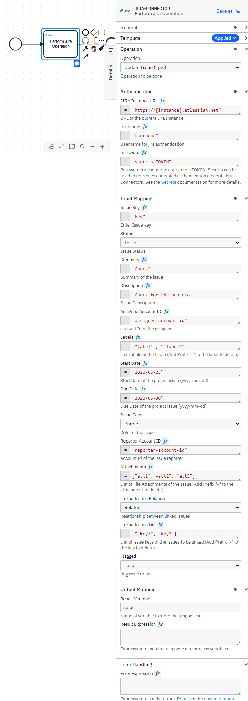

# Camunda JIRA Connector

Find the user documentation [here](#documentation)

## Build

```bash
mvn clean package
```

## API

### Input

##### Authentication Details

```json
{
  "authentication": {
        "url": "instance-url",
        "username": "Username",
        "password": "secrets.PASSWORD"
  },
  "operation": "",
  "data": {}
}
```

#### Input for Create Epic Issue

```json
{
      "authentication": {},
      "operation": "jira.create-issue-epic",
      "data": {
        "projectKey": "key",
        "status": "To Do",
        "summary": "text-summary",
        "description": "text-description",
        "assigneeAccID": "account-id",
        "labels": ["Verify", "Modify"],
        "startDate": "2023-06-23",
        "dueDate": "2023-06-30",
        "reporterAccID": "reporter-account-id",
        "attachments": ["C:/Users/username/Documents/a.txt","b.txt"],
        "linkedIssuesRelation": "Related",
        "linkedIssues": ["key1", "key2"],
        "flagged": "false"
      }
}
```
> **projectKey** should hold the key of the specific project in which issue has to be created.
> **status** can be "To Do", "In Progress" or "Done" which will the current situation of the issue.
> **summary** contain the task to be performed.
> **description** contain brief information about the task to be performed.
> **assigneeAccID** means account Id of the assignee to whom the issue will be assigned.
> **labels** is a list of strings that signifies the task of the issue.
> **startDate** Start Date of the issue.
> **dueDate** Due date of the issue.
> **reporterAccID** means account Id of the reporter by whom the issue will be reported.
> **attachments** represents the list of filenames or filepaths to be added as attachments of the issue.
> **linkedIssuesRelation** represents the relation between issues.
> **linkedIssues** represents the list of issues which link with current issue
> **flagged** if it is "true", the issue will be flagged else not.

</br>
#### Input for Create Issue

```json
{
      "authentication": {},
      "operation": "jira.create-issue",
      "data": {
        "projectKey": "key",
        "issueType": "Story",
        "status": "To Do",
        "summary": "text-summary",
        "description": "text-description",
        "assigneeAccID": "account-id",
        "sprint": "sprint-name",
        "sprintBoardId": "boardId-of-the-sprint",
        "storyPointEstimate": "14.0",
        "reporterAccID": "reporter-account-id",
        "attachments": ["C:/Users/username/Documents/a.txt","b.txt"],
        "linkedIssuesRelation": "Related",
        "linkedIssues": ["key1", "key2"],
        "flagged": "false"
      }
}
```
> **sprint** represents sprintname as per which issue to be resolved.
> **sprintBoardId** is the boardId of the board which contains the mentioned sprint.
> **storyPointEstimate** means estimated no.of story points for the issue.

#### Input for Get Board Details

```json
{
      "authentication": {},
      "operation": "jira.get-board-details",
      "data": {
        "boardName": "board-name",
        "boardType": "simple"
      }
}
```
> **boardName** means name of the board from which details to be retrieved.
> **boardType** means type of the board from whihch details to be retrieved.

#### Input for Get Issue

```json
{
  "authentication": {},
  "operation": "jira.get-issue",
  "data": {
    "issueKey": "key",
    "requiredFields": ["summary", "labels"],
    "excludeFields": [""],
    "expandFields": ["names", "operations"]
  }
}
```
> **issueKey** is the key of the issue from which details to be retrieved.
> **requiredFields** is the list of fields to be included in the response.
> **excludeFields** is the list of fields to be excluded from the response.
> **expandFields** is the list of fields to be expanded with details in response.

#### Input for Get Sprint Details

```json
{
  "authentication": {},
  "operation": "jira.get-sprint-details",
  "data": {
    "boardId": "id",
    "sprintState": "future"
  }
}
```

> **boardId** is the id of the board of the corresponding sprints.</br>
> **sprintState** is the state of the sprint through which filter sprints to get details.
</br>
#### Input for Update Epic Issue

```json
{
  "authentication": {},
  "operation": "jira.update-issue-epic",
  "data": {
      "issueKey": "key",
      "status": "To Do",
      "summary": "text-summary",
      "description": "text-description",
      "assigneeAccID": "account-id",
      "labels": ["Verify", "-Modify"],
      "startDate": "2023-06-23",
      "dueDate": "2023-06-30",
      "reporterAccID": "reporter-account-id",
      "attachments": ["C:/Users/username/Documents/a.txt","-b.txt"],
      "linkedIssuesRelation": "Related",
      "linkedIssues": ["-key1", "key2"],
      "flagged": "false"
  }
}

```

#### Input for Update Issue

```json
{
  "authentication": {},
  "operation": "jira.update-issue",
  "data": {
    "issueKey": "key",
    "issueType": "Story",
    "status": "To Do",
    "summary": "text-summary",
    "description": "text-description",
    "assigneeAccID": "account-id",
    "sprint": "sprint-name",
    "sprintBoardId": "boardId-of-the-sprint",
    "storyPointEstimate": "14.0",
    "reporterAccID": "reporter-account-id",
    "attachments": ["C:/Users/username/Documents/a.txt","b.txt"],
    "linkedIssuesRelation": "Related",
    "linkedIssues": ["key1", "key2"],
    "flagged": "false"
  }
}
```

### Output

```json
{
  "result": {
    "response": "....."
  }
}
```

## Test locally

Run unit tests

```bash
mvn clean verify
```

### Test as local Job Worker

Use
the [Camunda Connector Runtime](https://github.com/camunda-community-hub/spring-zeebe/tree/master/connector-runtime#building-connector-runtime-bundles)
to run your function as a local Job Worker.

See also the [:lock:Camunda Cloud Connector Run-Time](https://github.com/camunda/connector-runtime-cloud)

## Element Template

The element templates can be found in
the [jira-connector.json](element-templates/jira-connector.json) file.

# **Documentation**

**JIRA** – It is a well known Software Development tool widely used across industries, used for tracking the issues and project management purposes.
</br>
The JIRA Connector can be used for performing various kind of jira operations using templates from your BPMN process.


### **Prerequisites**

To start working with the JIRA Connector. User need a server details like - host, portNumber, username, password.

*The following parameters are necessary for establishing connection* -

-	**url**- It is the current running jira instance url.
-	**username** and **password**: Username and password of user with required privilege.

### **Creating JIRA connector task**

Currently, the JIRA Connector supports 7 types of operations: Create Epic Issue, Create Issue, Get Issue, Get Sprint Details, Get Board Details, Update Epic Issue, Update Issue.

To use a JIRA Connector in your process, either change the type of existing task by clicking on it and using the wrench-shaped **Change type** context menu icon or create a new Connector task by using the **Append Connector** context menu. Follow our [guide on using Connectors](https://docs.camunda.io/docs/components/connectors/use-connectors/) to learn more.

### **Making JIRA Connector executable**

To make the JIRA Connector executable, fill out the mandatory fields highlighted in red in the properties panel.

### **Authentication for JIRA Connector**

JIRA Connector authentication object takes – **url**, **username** and **password** *(as secrets Token i.e. secrets.Token)*.


## **Create Epic Issue**


> **To Create Epic Issue, take the following steps:**
1. In the ***Operation** section*, set the field value *Operation* as **Create Issue (Epic)**.
2. Set the required parameters and credentials in the **Authentication** section.
3. In the **Input Mapping** section, set the fields Project, Status, Summary, Description, Assignee Account ID, Labels, Start Date, Due Date, Issue Color, Reporter Account ID, Attachments, Linked Issues Relation, Linked Issues List, Flagged.
4. **Project** holds the value of project key.
5. **Status** is a drop-down menu which includes "To Do", "In Progress", "Done" and one has to be selected.
6. **Summary** should consist the task to be performed in the issue.
7. **Description** holds the brief information about what to be done.
8. **Assignee Account ID** holds the account id of the assignee.
9. **Labels** List of appropriate labels to easily identify the kind of task to be performed.
10. **Start Date** holds start date of issue in the format yyyy-mm-dd.
11. **Due Date** holds due date of the issue in the format yyyy-mm-dd.
12. **Issue Color** holds the color indicator for the issue.
13. **Reporter Account ID** holds the account id of the reporter.
14. **Attachments** hold the list of file paths or folder paths to be added as attachments in the issue.
15. **Linked Issues Relation** is a drop-down menu which includes several relationships between issues and have to select one.
16. **Linked Issues List** is the list of keys of the issues which have to be linked with the current issue with the relationship provided above.
17. **Flagged** should set to "true" if one need to flag the issue, or set as "false".
<br>
> **Create Epic Issue operation response**
You can use an output mapping to map the response:
- Use **Result Variable** to store the response in a process variable.
</br>

## **Create Issue**


> **To Create Issue, take the following steps:**
1. In the ***Operation** section*, set the field value *Operation* as **Create Issue**.
2. Set the required parameters and credentials in the **Authentication** section.
3. In the **Input Mapping** section, set the fields Project, Issue Type, Status, Summary, Description, Assignee Account ID, Labels, Sprint, Sprint Board ID, Story Point Estimate, Reporter Account ID, Attachments, Linked Issues Relation, Linked Issues List, Flagged.
4. **Project** holds the value of project key.
5. **Issue Type** is a drop-down menu which includes "Story", "Task" and "Bug", have to select one.
6. **Status** is a drop-down menu which includes "To Do", "In Progress", "Done" and one has to be selected.
7. **Summary** should consist the task to be performed in the issue.
8. **Description** holds the brief information about what to be done.
9. **Assignee Account ID** holds the account id of the assignee.
10. **Labels** List of appropriate labels to easily identify the kind of task to be performed.
11. **Sprint** holds the name of the sprint.
12. **Sprint Board ID** should hold the id the board which contains the mentioned sprint.
13. **Story Point Estimate** should hold the estimated value of story points.
14. **Reporter Account ID** holds the account id of the reporter.
15. **Attachments** hold the list of file paths or folder paths to be added as attachments in the issue.
16. **Linked Issues Relation** is a drop-down menu which includes several relationships between issues and have to select one.
17. **Linked Issues List** is the list of keys of the issues which have to be linked with the current issue with the relationship provided above.
18. **Flagged** should set to "true" if one need to flag the issue, or set as "false".
<br>
> **Create Issue operation response**
You can use an output mapping to map the response:
- Use **Result Variable** to store the response in a process variable.
</br>

## **Get Issue**


> **To Get Issue, take the following steps:**
1. In the ***Operation** section*, set the field value *Operation* as **Get Issue**.
2. Set the required parameters and credentials in the **Authentication** section.
3. In the **Input Mapping** section, set the fields Issue Key, Required Fields, Exclude Fields and Expand.
4. **Issue Key** holds the key of the issue.
5. **Required Fields** is a list of fields which has to be included in the response.
6. **Exclude Fields** is a list of fields which has to be excluded from the response.
7. **Expand** is a list of fields whose details should get expanded in the response.
<br>
> **Get Issue operation response**
You can use an output mapping to map the response:
- Use **Result Variable** to store the response in a process variable.
</br>

## **Get Sprint Details**


> **To Get Sprint Details, take the following steps:**
1. In the ***Operation** section*, set the field value *Operation* as **Get Sprints**.
2. Set the required parameters and credentials in the **Authentication** section.
3. In the **Input Mapping** section, set the fields Board ID, Sprint State.
4. **Board ID** is the id of the board from which one need to get the sprints.
5. **Sprint State** is the state of the sprint.
<br>
> **Get Sprint Details operation response**
You can use an output mapping to map the response:
- Use **Result Variable** to store the response in a process variable.
</br>

## **Get Board Details**


> **To Get Board Details, take the following steps:**
1. In the ***Operation** section*, set the field value *Operation* as **Get Board**.
2. Set the required parameters and credentials in the **Authentication** section.
3. In the **Input Mapping** section, set the fields Board Name, Board Type.
4. **Board Name** is the name of the board.
5. **Board Type** is the type of the board.
<br>
> **Get Board Details operation response**
You can use an output mapping to map the response:
- Use **Result Variable** to store the response in a process variable.
</br>

## **Update Epic Issue**



> **To Update Epic Issue, take the following steps:**
1. In the ***Operation** section*, set the field value *Operation* as **Update Issue (Epic)**.
2. Set the required parameters and credentials in the **Authentication** section.
3. In the **Input Mapping** section, set the fields Issue Key, Status, Summary, Description, Assignee Account ID, Labels, Start Date, Due Date, Issue Color, Reporter Account ID, Attachments, Linked Issues Relation, Linked Issues List, Flagged.
4. **Issue Key** holds the key of the issue to be updated.
5. **Status** is a drop-down menu which includes "To Do", "In Progress", "Done" and one has to be selected.
6. **Summary** should consist the task to be performed in the issue.
7. **Description** holds the brief information about what to be done.
8. **Assignee Account ID** holds the account id of the assignee.
9. **Labels** List of appropriate labels to easily identify the kind of task to be performed (prefix label with "-" to delete it).
10. **Start Date** holds start date of issue in the format yyyy-mm-dd.
11. **Due Date** holds due date of the issue in the format yyyy-mm-dd.
12. **Issue Color** holds the color indicator for the issue.
13. **Reporter Account ID** holds the account id of the reporter.
14. **Attachments** hold the list of file paths or folder paths to be added as attachments in the issue (prefix attachment with "-" to delete it).
15. **Linked Issues Relation** is a drop-down menu which includes several relationships between issues and have to select one.
16. **Linked Issues List** is the list of keys of the issues which have to be linked with the current issue with the relationship provided above (prefix key with "-" to delete it).
17. **Flagged** should set to "true" if one need to flag the issue, or set as "false".
<br>
> **Update Epic Issue operation response**
You can use an output mapping to map the response:
- Use **Result Variable** to store the response in a process variable.
</br>

## **Update Issue**


> **To Update Issue, take the following steps:**
1. In the ***Operation** section*, set the field value *Operation* as **Update Issue**.
2. Set the required parameters and credentials in the **Authentication** section.
3. In the **Input Mapping** section, set the fields Issue Key, Issue Type, Status, Summary, Description, Assignee Account ID, Labels, Sprint, Sprint Board ID, Story Point Estimate, Reporter Account ID, Attachments, Linked Issues Relation, Linked Issues List, Flagged.
4. **Issue Key** holds key of the issue.
5. **Issue Type** is a drop-down menu which includes "Story", "Task" and "Bug", have to select one.
6. **Status** is a drop-down menu which includes "To Do", "In Progress", "Done" and one has to be selected.
7. **Summary** should consist the task to be performed in the issue.
8. **Description** holds the brief information about what to be done.
9. **Assignee Account ID** holds the account id of the assignee.
10. **Labels** List of appropriate labels to easily identify the kind of task to be performed (prefix label with "-" to delete it).
11. **Sprint** holds the name of the sprint.
12. **Sprint Board ID** should hold the id the board which contains the mentioned sprint.
13. **Story Point Estimate** should hold the estimated value of story points.
14. **Reporter Account ID** holds the account id of the reporter.
15. **Attachments** hold the list of file paths or folder paths to be added as attachments in the issue (prefix attachment with "-" to delete it).
16. **Linked Issues Relation** is a drop-down menu which includes several relationships between issues and have to select one.
17. **Linked Issues List** is the list of keys of the issues which have to be linked with the current issue with the relationship provided above (prefix key with "-" to delete it).
18. **Flagged** should set to "true" if one need to flag the issue, or set as "false".
<br>
> **Update Issue operation response**
You can use an output mapping to map the response:
- Use **Result Variable** to store the response in a process variable.
</br>

# **Appendix & FAQ**

### **How can I authenticate JIRA Connector?**

The JIRA Connector needs the credentials for connection -
-	**url**: It is the current running jira instance url.
-	**username** and **password**: Username and password of user with required privilege.
