# Camunda MS SQL Database Connector

Find the user documentation [here](#documentation)

## Build

```bash
mvn clean package
```

## API

### Input

##### Database Connection Details

```json
{
  "databaseConnection": {
    "host": "HOSTNAME",
    "port": "PORT_NUMBER",
    "username": "USERNAME",
    "password": "secrets.MY_SECRET"
  },
  "operation": "",
  "data": {}
}
```

### Data

#### Input for Create Database

```json
{
  "databaseConnection": {},
  "operation": "mssql.create-database",
  "data": {
    "databaseName": "db_name"
  }
}
```

#### Input for Create Table

```json
{
  "databaseConnection": {},
  "operation": "mssql.create-table",
  "data": {
    "databaseName": "db_name",
    "tableName": "table_name",
    "columnsList": [
      {
        "constraints": [
          "NOT NULL",
          "PRIMARY KEY"
        ],
        "dataType": "int",
        "colName": "empid"
      },
      {
        "Datatype": "varchar(50)",
        "ColName": "empName"
      },
      {
        "datatype": "int",
        "colname": "empNumber"
      }
    ]
  }
}
```

#### Input for Alter Table

```json
{
  "databaseConnection": {},
  "operation": "mssql.alter-table",
  "data": {
    "databaseName": "db_name",
    "tableName": "table_name",
    "method": "renameTable",
    "newTableName": "rio"
  }
}
```

> **_*NOTE:*_** Please refer [documentation](#documentation) for other *Method types* (
> ***disableConstraint, enableConstraint, modifyColumn, renameTable, renameColumn, dropColumn, dropConstraint,
> addConstraint, addColumn*** ) and
> their respective input parameters.

#### Input for Insert Data

```json
{
  "databaseConnection": {},
  "operation": "mssql.insert-data",
  "data": {
    "databaseName": "db_name",
    "tableName": "table_name",
    "dataToInsert": [
      {
        "PersonID": 1,
        "FirstName": "Alpha"
      }
    ]
  }
}
```

#### Input for Delete Data

```json
{
  "databaseConnection": {},
  "operation": "mssql.delete-data",
  "data": {
    "databaseName": "db_name",
    "tableName": "table_name",
    "filters": {
      "filter": {
        "colName": "firstname",
        "operator": "=",
        "value": "Xon"
      }
    },
    "orderBy": [
      {
        "sortOn": "firstname",
        "order": "desc"
      }
    ],
    "top": 1
  }
}
```

> **filters** is a map with keys - filter, filterList and logicalOperator. It will be used to create where clause.</br>
> The value for filter key is a map with keys - colName, operator and value.</br>
> For complex filter ( more than one condition ) logicalOperator and filterList must co-exist.</br>

> ***Examples :***</br>
> **1. Simple filter **↴****</br>

```json
{
  "filter": {
    "colName": "alias",
    "operator": "like",
    "value": "%superman%"
  }
}
```

> **2. Simple filter with negation **↴****</br>

```json
{
  "filter": {
    "colName": "alias",
    "operator": "like",
    "value": "%superman%"
  },
  "logicalOperator": "NOT"
}
```

> **3. Complex filter **↴****</br>

```json
{
  "logicalOperator": "AND",
  "filterList": [
    {
      "filter": {
        "colName": "empAddress",
        "operator": "=",
        "value": "Krypton"
      }
    },
    {
      "filter": {
        "colName": "empName",
        "operator": "like",
        "value": "%superman%"
      }
    },
    {
      "filter": {
        "colName": "age",
        "operator": ">",
        "value": 28
      }
    }
  ]
}
```

<br>

> **OrderBy** is a list of maps with keys - sortOn and order. It will be used to create orderBy clause for SQL
> query.</br>
> ***Example :***</br>

```json
[
  {
    "sortOn": "columnName1",
    "order": "desc"
  },
  {
    "sortOn": "columnName2",
    "order": "asc"
  }
]
```

> **_*Link:*_** Please refer [documentation](#documentation) **Appendix & FAQ** for more details

#### Input for Read Data

```json
{
  "databaseConnection": {},
  "operation": "mssql.read-data",
  "data": {
    "databaseName": "db_name",
    "tableName": "table_name",
    "columnNames": [
      "firstname"
    ],
    "filters": {
      "logicalOperator": "not",
      "filter": {
        "colName": "firstname",
        "operator": "=",
        "value": "Xon"
      }
    },
    "orderBy": [
      {
        "sortOn": "firstname",
        "order": "desc"
      }
    ],
    "top": 1
  }
}
```

#### Input for Update Data

```json
{
  "databaseConnection": {},
  "operation": "mssql.update-data",
  "data": {
    "databaseName": "db_name",
    "tableName": "table_name",
    "updateMap": {
      "city": "Uri",
      "firstname": "Kat"
    },
    "filters": {
      "logicalOperator": "not",
      "filter": {
        "colName": "firstname",
        "operator": "=",
        "value": "Xon"
      }
    },
    "orderBy": [
      {
        "sortOn": "firstname",
        "order": "desc"
      }
    ],
    "top": 1
  }
}
```

### Output

```json
{
  "result": {
    "response": "....."
  }
}
```

## Test locally

Run unit tests

```bash
mvn clean verify
```

### Test as local Job Worker

Use
the [Camunda Connector Runtime](https://github.com/camunda-community-hub/spring-zeebe/tree/master/connector-runtime#building-connector-runtime-bundles)
to run your function as a local Job Worker.

See also the [:lock:Camunda Cloud Connector Run-Time](https://github.com/camunda/connector-runtime-cloud)

## Element Template

The element templates can be found in
the [ms-sql-database-connector.json](element-templates/ms-sql-database-connector.json) file.

# **Documentation**

The **MS-SQL Connector** allows you to perform CRUD operation on MS-SQL database.  
You can choose the required operation from the dropdown using templates from your BPMN process.

### **Prerequisites**

To start working with the **MS-SQL Connector**, a relevant database user password must be configured and stored as a secret in your cluster. The user must have permission to perform database operation on given database instance.

### **Create a MS-SQL Connector task**

Currently, the MS-SQL Connector supports seven types of operations: create database, create table, insert data into the table, delete data from the table, update table data, read table data and alter table.

To use a MS-SQL Connector in your process, either change the type of existing task by clicking on it and using the wrench-shaped **Change type** context menu icon or create a new Connector task by using the **Append Connector** context menu. Follow our [guide on using Connectors](https://docs.camunda.io/docs/components/connectors/use-connectors/) to learn more.

### **Make your MS-SQL Connector executable**

To make the MS-SQL Connector executable, fill out the mandatory fields highlighted in red in the properties panel.

### **Database connection Object input for MS-SQL Connector**

MSSQL Connector database connection object takes – host, port, username and password.
e.g. localhost, 1433, username, password (as secrets Token e.g. secrets.MSSQL_TOKEN )


## Create a new database
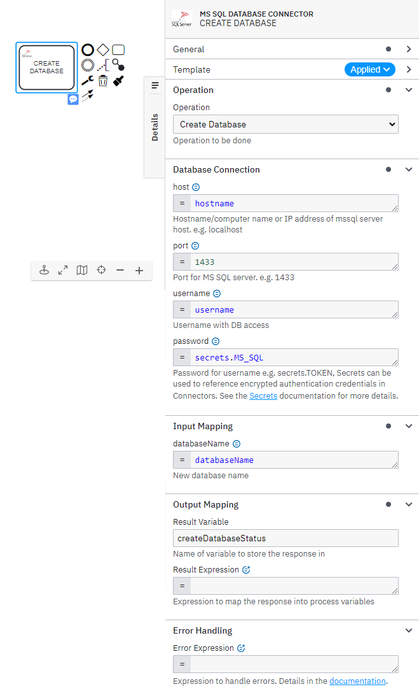

> **To create a database, take the following steps:**
1.	In the *Operation* section, set the field value *Operation* as **Create Database**.
2.	Set the required parameters and credentials in the **Database Connection** section. See the relevant appendix entry to find out more.
3.	In the **Input Mapping** section, set the field **databaseName** as the desired name of a database you wish to create. For example, *NewDatabaseName*. 
Alternatively, you could use a FEEL expression.

<br>

> **Create Database operation response**

You can use an output mapping to map the response:
 -	Use **Result Variable** to store the response in a process variable. For example, *createDatabaseStatus*.

## Create a new table
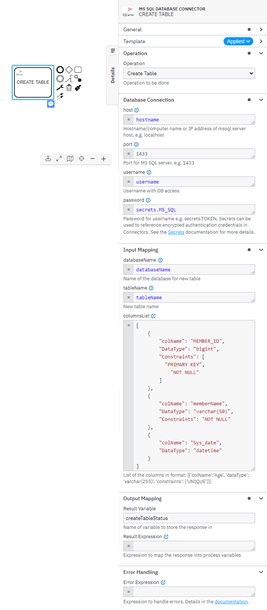

> **To create a table, take the following steps:**
1.	In the *Operation* section, set the field value *Operation* as **Create Table**.
2.	Set the required parameters and credentials in the **Database Connection** section. See the relevant appendix entry to find out more.
3.	In the **Input Mapping** section, set the field **databaseName** and **tableName** as the desired name of a table you wish to create. For example, *MyNewTable*. Alternatively, you could use a FEEL expression.
4.	Set **columnsList**, using FEEL expression as List of columns details, which is a List of context having keys as colName, datatype and constraints.

<br>

> **Create Table operation response**

You can use an output mapping to map the response:
-	Use **Result Variable** to store the response in a process variable. For example, *createTableStatus*.

## Insert data into the table

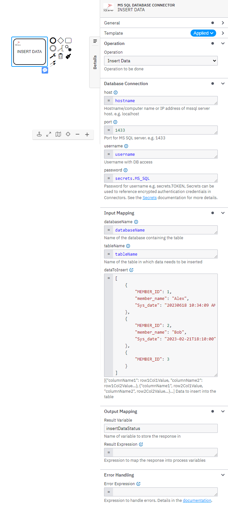

> **To insert data into the table, take the following steps:**
1.	In the *Operation* section, set the field value *Operation* as **Insert Data**.
2.	Set the required parameters and credentials in the **Database Connection** section. See the relevant appendix entry to find out more.
3.	In the **Input Mapping** section, set the field **databaseName**, **tableName**.
4.	Set **dataToInsert**, using FEEL expression as List of columns details, which is a `List of context having keys as name, datatype and constraint`.
5.	We are following Insert syntax - INSERT INTO tableName ( columnNames ) VALUES (*)
where *columnNames* is list of comma-separated column names extracted from keyset of first item in the dataToInsert List. 

<br>

> **Insert Data operation response**

You can use an output mapping to map the response:
-	Use **Result Variable** to store the response in a process variable. For example, *insertDataStatus*.

## Update table Data

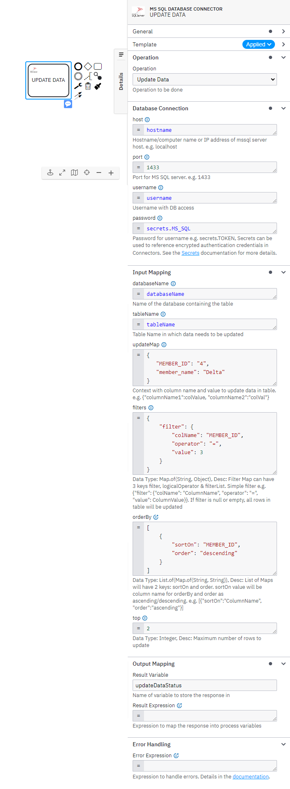

> **To update table data, take the following steps:**
1.	In the *Operation* section, set the field value *Operation* as **Update Data**.
2.	Set the required parameters and credentials in the **Database Connection** section. See the relevant appendix entry to find out more.
3.	In the **Input Mapping** section, set the field **databaseName**, **tableName**.
4.	Set **updateMap**, using FEEL expression as context with key-value pairs for columnName & value.
    > e.g. `{"empAddress": "Krypton", "empName": "Kal-El"}`
    
    These fields will update for all the rows which match the filter condition.
5.	Set **filters**, using FEEL expression as context with keys as - filter, logicalOperator & filterList.
    e.g.
    ```json
    {
      "filter": {
          "colName": "alias",
          "operator": "like",
          "value": "%superman%"
      }
    }
     ```
    These will used to construct the where clause for the SQL query.
6.	Set **orderBy**, using FEEL expression as list of context with keys – sortOn and order.
    e.g. 
    ```json
    [
        {
            "sortOn": "powers",
            "order": "descending"
        }
    ]
    ```
    These will used to construct the orderBy clause for the SQL query. The order of rows to update.
7.	Set **top**, the maximum number of rows to update.

<br>

> **Update Table Data operation response**

You can use an output mapping to map the response:
- Use **Result Variable** to store the response in a process variable. For example, updateDataStatus.

## Delete table Data
 
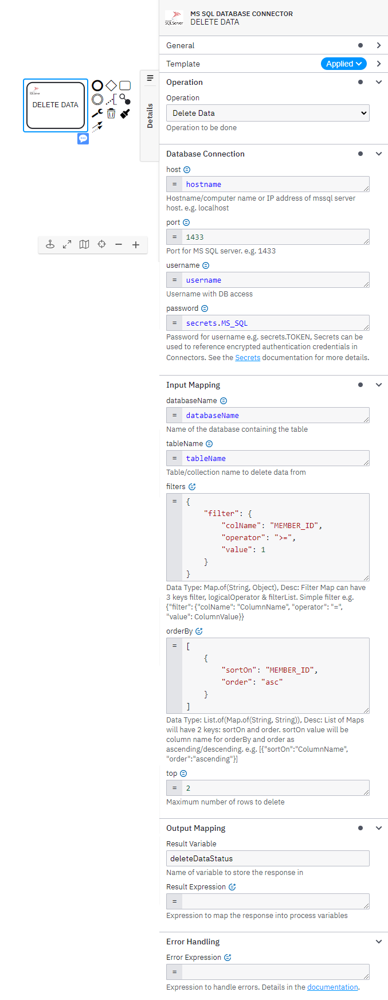

> **To delete table data, take the following steps:**
1.	In the *Operation* section, set the field value *Operation* as **Delete Data**.
2.	Set the required parameters and credentials in the **Database Connection** section. See the relevant appendix entry to find out more .
3.	In the **Input Mapping** section, set the field **databaseName**, **tableName**.
4.	Set **filters**, using FEEL expression as context with keys as - filter, logicalOperator & filterList.
    e.g.
    ```json
    {
      "filter": {
          "colName": "alias",
          "operator": "like",
          "value": "%superman%"
      }
    }
     ```
    These will used to construct the where clause for the SQL query. All the matched rows will be deleted.
5.	Set **orderBy**, using FEEL expression as list of context with keys – sortOn and order.
    e.g. 
    ```json
    [
        {
            "sortOn": "powers",
            "order": "descending"
        }
    ]
    ```
    These will used to construct the orderBy clause for the SQL query. The order of rows to delete.
6.	Set **top**, the maximum number of rows to delete.

<br>

> **Delete Table Data operation response**

You can use an output mapping to map the response:
- Use **Result Variable** to store the response in a process variable. For example, *deleteDataOutput*.

## Read table Data
 
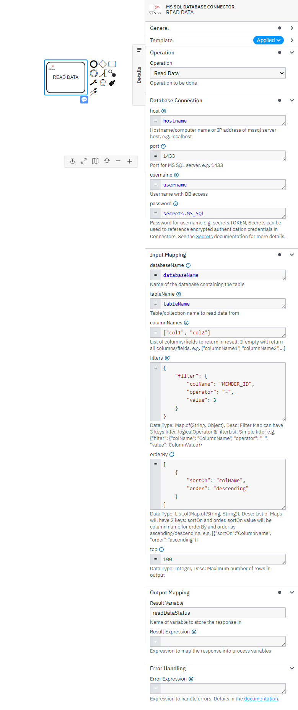

> To read table data, take the following steps:
1.	In the *Operation* section, set the field value *Operation* as **Read Data**.
2.	Set the required parameters and credentials in the **Database Connection** section. See the relevant appendix entry to find out more.
3.	In the **Input Mapping** section, set the field **databaseName**, **tableName**.
4.	Set **columnNames**, using FEEL expression as List of columns to get in the output variable. e.g. `[“col1”, “col2”]`
5.	Set **filters**, using FEEL expression as context with keys as - filter, logicalOperator & filterList. 
    e.g.
    ```json
    {
      "filter": {
          "colName": "alias",
          "operator": "like",
          "value": "%superman%"
      }
    }
     ```
    These will used to construct the where clause for the SQL query. All the matched rows will be returned in the output.
6.	Set **orderBy**, using FEEL expression as list of context with keys – sortOn and order.
    e.g. 
    ```json
    [
        {
            "sortOn": "powers",
            "order": "descending"
        }
    ]
    ```
    These will used to construct the orderBy clause for the SQL query. The order of rows in output.
7.	Set **top**, the maximum number of rows in output.

<br>

> **Read Table Data operation response**

You can use an output mapping to map the response:
- Use **Result Variable** to store the response in a process variable. For example, readDataOutput. It’s a List of Maps with keys as column name and value as respective row data.

## Alter table
 
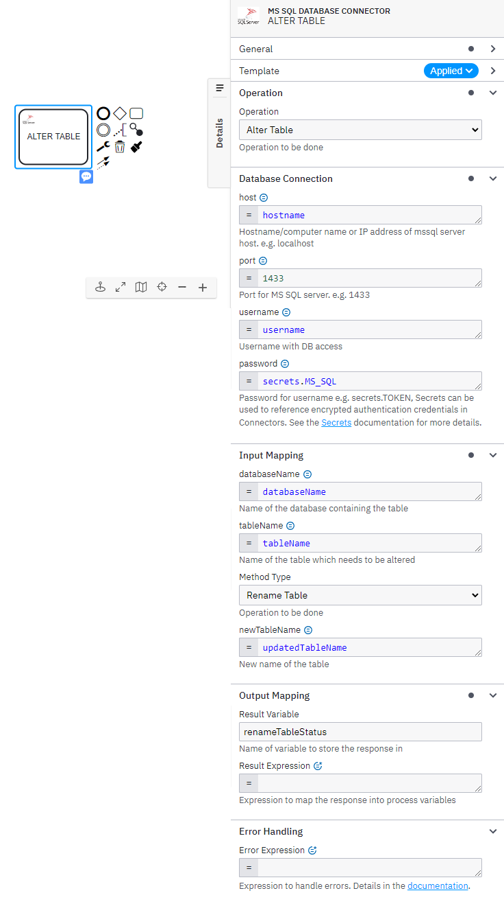

> **To alter table, take the following steps:**
1.	In the *Operation* section, set the field value *Operation* as **Alter Table**.
2.	Set the required parameters and credentials in the **Database Connection** section. See the relevant appendix entry to find out more.
3.	In the **Input Mapping** section, set the field **databaseName**, **tableName**.
4.	Set **Method Type**, types of alter operations -
    1.	**Rename Table**

      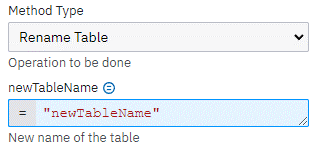
    
    2.	**Rename Column**

       to new name ( newColName )")

    3.	**Add Constraint**

      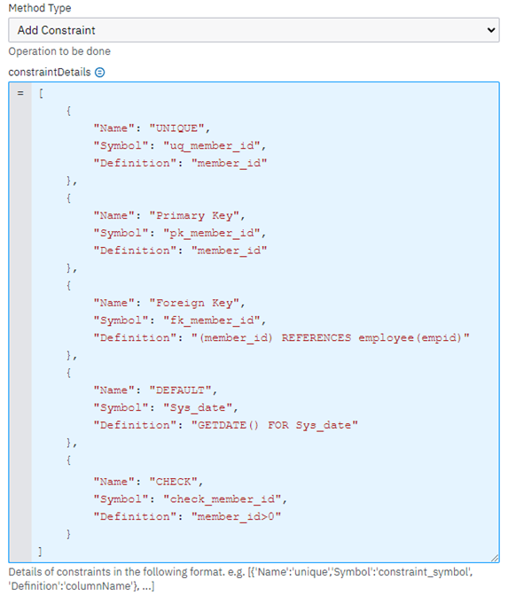

    >Add constraints to the table, use FEEL expression to provide input constraintDetails as *List of contexts with keys as – name, symbol, and definition*.
    >1. **Name** – Type of constraint e.g. *UNIQUE*, *DEFAULT*, *PRIMARY KEY*, *FOREIGNKEY* or *CHECK*
    >2. **Symbol** – The constraint name e.g. pk_id, fk_cin
    >3. **Definition** – Column name on which constraint needs to be applied

    4.	**Drop Columns**

      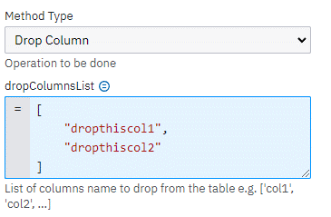

    > Drop column from the table, use FEEL expression to provide input **dropColumnsList** as *List of column names*.

    5.	**Drop Constraints**

      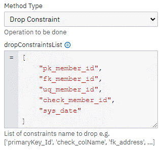

    > Drop constraint from the table, use FEEL expression to provide input **dropConstraintsList** as *List of constraint names*.

    6.	**Modify Column**

      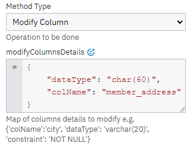

    >Set *modifyColumnsDetails*, using FEEL expression as List of contexts. Each context can have keys as – **colName**, **dataType** and **constraint.**
    **colName is mandatory** and datatype or constraint can be provided to update.

    7.	**Add Column**

      

    >Set *columnsDetails*, using FEEL expression as List of contexts. Each context can have keys as **colName**, **dataType** and **constraint**.
    *name and dataType are **mandatory***.

    8.	**Enable Constraint**

      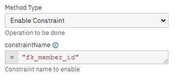

    9.	**Disable Constraint**

      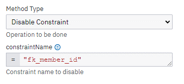

<br>

> **Alter Table operation response**

  You can use an output mapping to map the response:
  - Use **Result Variable** to store the response in a process variable. For example, alterTableOutput.

<br>
<br>

## **Appendix & FAQ**

**Database Connection – Params values**

Database connection group have 4 params – host, port, username, and password. These values will be used to connect to the database server.

**How can I authenticate my Connector?**

The MS-SQL Connector needs the database credentials for connection. Hostname (host) – of the server where database is hosted, Port (port) – on which database server is running, Username (username) – User with proper privilege for operation and Password (password) – User password, which need to be saved as a Token in Secret vault and input can be provided as: secrets.TOKEN_NAME

**What is filters input parameter?**

Filters input is Map with keys – filter, logicalOperator and filterList. 

  1. filter key’s value is a Map with keys – *colName*, *operator* and *value*. 

      **colName** – is column name to apply condition on.

      >Supported **operator** are :   
      `[ =, ==, equals, <>, not equals, <, less than, >, greater than, <=, less than or equals, >=, greater than or equals, like, in, is, not in, starts with, ends with ]`

      **value** - is an Object and can be anything.


  2. **logicalOperator** key’s value can be OR, AND or NOT

  3. **filterList** key’s value is a list of Map with key filter. And value for this filter key must follow 1st point.

filter key can exist individually or with optional logicalOperator ( value - NOT ).
But filterList and logicalOperator both must be present, logicalOperator value will be used to club all filters in the filterList.

If filterList key is present in the main map, filter key will be ignored.


>Internally it is being used for constructing where clause for SQL query.
Filters can be of two type –
>1.	Simple Filter – It will contain just one condition and may be a negation.
>2.	Complex Filter – It is collection of simple filters, aggregated using logical operator like **AND**/**OR**.

*Examples:*

**Simple filter without negation**

```json
{
    "filter": {
        "colName": "alias",
        "operator": "like",
        "value": "%superman%"
    }
}
```

**Simple filter with negation**
```json
{
    "filter": {
        "colName": "alias",
        "operator": "like",
        "value": "%superman%"
    },
    "logicalOperator": "NOT"
}
```

**Complex filter**
```json
{
    "logicalOperator": "AND",
    "filterList": [
        {
            "filter": {
                "colName": "empAddress",
                "operator": "=",
                "value": "Krypton"
            }
        },
        {
            "filter": {
                "colName": "empName",
                "operator": "like",
                "value": "%superman%"
            }
        },
        {
            "filter": {
                "colName": "age",
                "operator": ">",
                "value": 28
            }
        }
    ]
}
```

**What is orderBy input parameter?**

orderBy input is a List of Map with keys – sortOn and order. As the name suggests, internally it is being used to construct order by clause.

**sortOn** – contains the column name
**order** – a/asc/ascending   OR   d/desc/descending
```json
[
    {
        "sortOn": "empId",
        "order": "descending"
    }
]
```

**What is top input parameter?**

top is the maximum number of rows for operation.
In case of read data it’s maximum number of rows to return in the output.