# Camunda SFTP File Connector

Find the user documentation [here](#documentation)

## Build

```bash
mvn clean package
```

## API

### Input

##### Authentication Details

```json
{
  "authentication": {
    "host": "HOSTNAME",
    "port": "22",
    "username": "USERNAME",
    "password": "secrets.MY_SECRET",
    "knownHostsPath": "C:/Users/user/.ssh/known_hosts"
  },
  "operation": "",
  "data": {}
}
```

#### Input for Copy File

```json
{
  "authentication": {},
  "operation": "sftp.copy-file",
  "data": {
    "sourceFilePath": "C:/Users/user/Documents/Source/demo.txt",
    "targetDirectory":"C:/Users/user/Documents/Target",
    "actionIfFileExists":"rename",
    "createNewFolderIfNotExists":"True"
  }
}
```
> **actionIfFileExists** can be "rename","replace" or "skip". If file which is going to be copied in target folder already exists in target folder, then this three operations can be performed.
</br>
> **createNewFolderIfNotExists** is set as a "True" then it will create a "targetDirectory" if not exists.
#### Input for Copy Folder

```json
{
  "authentication": {},
  "operation": "sftp.copy-folder",
  "data": {
    "sourceDirectory": "C:/Users/user/Documents/Source/demo.txt",
    "targetDirectory":"C:/Users/user/Documents/Target",
    "actionIfFileExists":"rename"
  }
}
```

#### Input for Delete File

```json
{
  "authentication": {},
  "operation": "sftp.delete-file",
  "data": {
    "folderPath": "C:/Users/user/Documents/Source",
    "fileName":"demo.txt"
  }
}
```

#### Input for Delete Folder

```json
{
  "authentication": {},
  "operation": "sftp.delete-folder",
  "data": {
    "folderPath": "C:/Users/user/Documents/Source"
  }
}
```

#### Input for List Files

```json
{
  "authentication": {},
  "operation": "sftp.list-files",
  "data": {
    "filePath":"C:/Users/user/Documents/Source",
    "fileNamePattern":"demo",
    "modifiedBefore":"31-3-2023 12:0:0",
    "modifiedAfter":"29-3-2023 12:0:0",
    "searchSubFoldersAlso":"True",
    "maxNumberOfFiles":"5",
    "maxDepth":"2",
    "outputType":"FileNames",
    "sortBy":{
      "sortOn":"size",
      "order":"asc"
    }

  }
}
```

> **modifiedBefore** is the date field in the format "dd/M/yyyy hh:mm:ss" which will list all the files which are modified before this date.</br>
> **modifiedAfter** is the date field in the format "dd/M/yyyy hh:mm:ss" which will list all the files which are modified after this date</br>
> **searchSubFoldersAlso** can be True or False. If "True" it will list all the files in sub folders also. If "false" it will list files in current folder only.</br>
> **maxDepth** indicates a maximum level it will go for listing files.</br>
> **maxNumberOfFiles** is the maximum number of files/folders in output.</br>
> **outputType** it can be  "fileNames" or "fileDetails".</br>
> **sortBy** is a map with keys - sortOn and order. It will be used to  *sort* files</br>
> sortOn can be - "size","date"," last Accessed file","name"</br>
> Order can be - "asc","desc"</br>
> Date String should be in format - "dd/M/yyyy hh:mm:ss"</br>

***Examples :***
```json
{
  "sortOn": "size",
  "order":"asc"
}
```

> {"sortOn": "date","order":asc"} -> *Sort files according to last modified date*</br>
> {"sortOn": "name","order":asc"} -> *Sort files according to file name*</br>
> {"sortOn": "size","order":desc"} -> *Sort files according to file size*</br>
> {"sortOn": "last accessed date","order":desc"} -> *Sort files according to last accessed date*</br>

#### Input for List Folders

```json
{
  "authentication": {},
  "operation": "sftp.list-folders",
  "data": {
    "folderPath":"C:/Users/user/Documents/Source",
    "namePattern":"demo",
    "modifiedBefore":"31-3-2023 12:0:0",
    "modifiedAfter":"29-3-2023 12:0:0",
    "searchSubFoldersAlso":"True",
    "maxNumberOfFiles":"5",
    "maxDepth":"2",
    "outputType":"FileNames",
    "sortBy":{
      "sortOn":"size",
      "order":"asc"
    }

  }
}
```

#### Input for Create Folder

```json
{
  "authentication": {},
  "operation": "sftp.create-folder",
  "data": {
    "folderPath": "C:/Users/user/Documents",
    "newFolderName": "Target",
    "actionIfFileExists":"rename"
  }
}
```
> **actionIfFileExists** can be "rename","replace" or "skip". If folder which is going to be created in target folder already exists in target folder, then this three operations can be performed.


#### Input for Move File

```json
{
  "authentication": {},
  "operation": "sftp.move-file",
  "data": {
    "sourceFilePath": "C:/Users/user/Documents/demo.txt",
    "targetDirectory": "C:/Users/user/Documents/demoFolder",
    "actionIfFileExists":"rename"
  }
}
```

#### Input for Move Folder

```json
{
  "authentication": {},
  "operation": "sftp.move-folder",
  "data": {
    "sourceDirectory": "C:/Users/user/Documents/demo1",
    "targetDirectory": "C:/Users/user/Documents/demoFolder",
    "actionIfFileExists":"replace"
  }
}
```


#### Input for Read File

```json
{
  "authentication": {},
  "operation": "sftp.read-file",
  "data": {
    "sourceFilePath": "C:/Users/user/Documents/demo1/demo.txt"
  }
}
```

#### Input for Write File

```json
{
  "authentication": {},
  "operation": "sftp.write-file",
  "data": {
    "filePath": "C:/Users/user/Documents/demo1/demo.txt",
    "content": "Hello World!!"
  }
}
```


### Output

```json
{
  "result": {
    "response": "....."
  }
}
```

## Test locally

Run unit tests

```bash
mvn clean verify
```

### Test as local Job Worker

Use
the [Camunda Connector Runtime](https://github.com/camunda-community-hub/spring-zeebe/tree/master/connector-runtime#building-connector-runtime-bundles)
to run your function as a local Job Worker.

See also the [:lock:Camunda Cloud Connector Run-Time](https://github.com/camunda/connector-runtime-cloud)

## Element Template

The element templates can be found in
the [sftp-file-connector.json](element-templates/sftp-file-connector.json) file.

# **Documentation**

**SFTP** – *Secure File Transfer Protocol or SSH File transfer Protocol*. It is an application-layer Internet standard protocol which is basically the advanced version of FTP(file transfer protocol) which ensures security while transferring files between the organizations/computer
</br>
The SFTP Connector can be used for performing various kind of file operations using templates from your BPMN process.


### **Prerequisites**

To start working with the SFTP Connector. user need a server details like - host, portNumber, username, password,known_hosts path.

*The following parameters are necessary for establishing connection* -

-	**host**- A hostname is a distinct name or label assigned to any device connected to a computer network, in this case its location where server is hosted.
-	**portNumber**: Port Number of SFTP server(default is 22)
-	**username** and **password**: Username and password of user with required privilege.
-	**known_hosts Path**: known_hosts file contains the public key of the SSH server which basically ensures that other server cannot  maliciously impersonate another server i.e. man-in-the-middle attacks. If you don't have this file one can easily generate it. For this one required OpenSSH Client.

### **Creating SFTP connector task**

Currently, the SFTP Connector supports eleven types of operations: Copy File, Copy Folder, Create Folder, Delete File, Delete Folder, List Files, List Folders, Move File, Move Folder, Read File and Write File.

To use a SFTP Connector in your process, either change the type of existing task by clicking on it and using the wrench-shaped **Change type** context menu icon or create a new Connector task by using the **Append Connector** context menu. Follow our [guide on using Connectors](https://docs.camunda.io/docs/components/connectors/use-connectors/) to learn more.

### **Making SFTP Connector executable**

To make the SFTP Connector executable, fill out the mandatory fields highlighted in red in the properties panel.

### **Authentication for SFTP Connector**

SFTP Connector authentication object takes – **host**, **portNumber**, **username** and **password** *(as secrets Token i.e. secrets.Token)*, **KnownHostsPath**.


## **List Files**

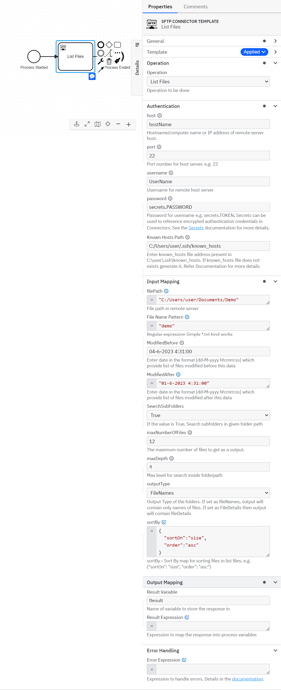

> **To List Files, take the following steps:**
1.	In the ***Operation** section*, set the field value *Operation* as **List Files**.
2.	Set the required parameters and credentials in the **Authentication** section.
3.	In the **Input Mapping** section, set the field filePath, File Name Pattern, modifiedBefore, modifiedAfter, SearchSubFolders, maxNumberOfFiles, MaxDepth, outputType, sortBy . You must use FEEL expression for sortBy.
4. **modifiedBefore** is the date field in the format "dd/M/yyyy hh:mm:ss" which will list all the files which are modified before this date.
5. **modifiedAfter** is the date field in the format "dd/M/yyyy hh:mm:ss" which will list all the files which are modified after this date
6. **searchSubFoldersAlso** can be True or False. If "True" it will list all the files in sub folders also. If "false" it will list files in current folder only.
7. **maxDepth** indicates a maximum level it will go for listing files.
8. Set [**sortBy**](#what-is-sortby-input-parameter), using FEEL expression as list of context with keys – sortOn and order.
   e.g.
    ```json
    {
      "sortOn":"date",
      "order":"desc"
    }
    ```
   For sortOn key different values can be used like size, date, modifiedDate, last accessed date and name. </br>
    For order key use "asc” or “desc” which sort according to ascending and descending order.

9.	**maxNumberOfFiles** is maximum number of files in output

10.	**outputType** can be selected as **FileNames** or **FileDetails** as per requirements.

<br>

> **List Files operation response**

You can use an output mapping to map the response:
- Use **Result Variable** to store the response in a process variable. Response is based on what one selects in outputType i.e. FileNames or FileDetails.
</br>
- FileNames - Name of files.
  FileDetails - List of maps of file attribute information related to - name, size, parent, path, etc.

## **List Folders**

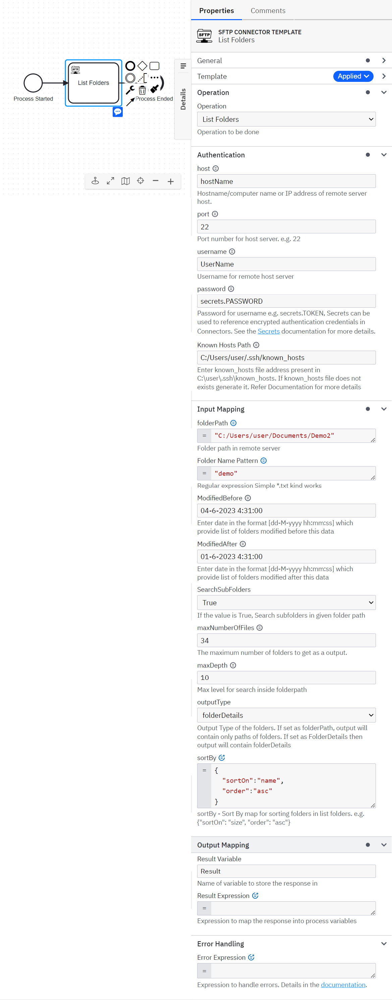

> **To List Folders, take the following steps:**
1.	In the ***Operation** section*, set the field value *Operation* as **List Folders**.
2.	Set the required parameters and credentials in the **Authentication** section.
3.	In the **Input Mapping** section, set the field folderPath, Folder Name Pattern, modifiedBefore, modifiedAfter, SearchSubFolders, maxNumberOfFiles, MaxDepth, outputType, sortBy . You must use FEEL expression for sortBy.
4.  File Path e.g. ```C:/Users/user/Documents/sourceFolder/demo.txt```
5. Set [**sortBy**](#what-is-sortby-input-parameter), using FEEL expression as list of context with keys – sortOn and order.
   e.g.
    ```json
    {
      "sortOn":"date",
      "order":"desc"
    }
    ```
   For sortOn key different values can be used like size, date, modifiedDate, last accessed date and name.</br>
For order key use "asc” or “desc” which sort according to ascending and descending order.

6.	**maxNumberOfFolders** is maximum number of folders in output

7.	**outputType** can be selected as **FolderNames** or **FolderDetails** as per requirements.

<br>

> **List Folders operation response**

You can use an output mapping to map the response:
- Use **Result Variable** to store the response in a process variable. Response is based on what one selects in outputType i.e. FolderNames or FolderDetails.
</br>
- FolderNames - Name of folder.
  FolderDetails - List of maps of folder attribute information related to - name, size, parent, path, etc.

## **Move File**

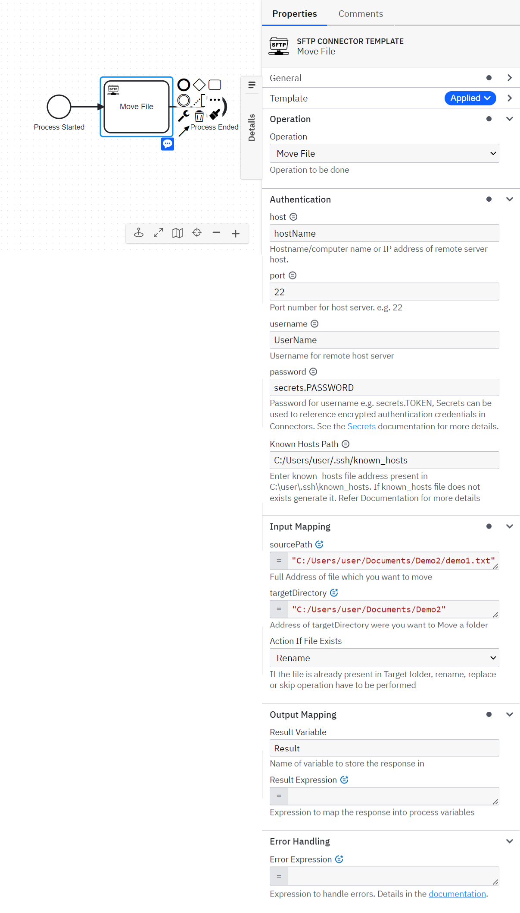

> **To Move File, take the following steps:**
1.	In the ***Operation** section*, set the field value *Operation* as **Move File**.
2.	Set the required parameters and credentials in the **Authentication** section.
3.	In the **Input Mapping** section, set the field **sourcePath**, **targetDirectory**, **Action if File Exists**".
4.	Set **sourcePath**, which is basically a path of file which will be moved. (Mention a file name with extension)
      e.g. ```C:/Users/user/Documents/sourceFolder/demo.txt```
5. Set **targetDirectory**, which is basically a path of folder where file is going to moved.
6. Set "Action If File Exists" as "rename", "replace" or "skip". This operations are performed when the file is already exists in a target folder.
   </br> If **rename** is selected  then it will rename a file.
   </br> If **replace** is selected then it will replace a file.
   </br> if **skip** is selected then it will skip this operation/file.

> **Move File operation response**

You can use an output mapping to map the response:
-	Use **Result Variable** to store the response in a process variable.

## **Move Folder**

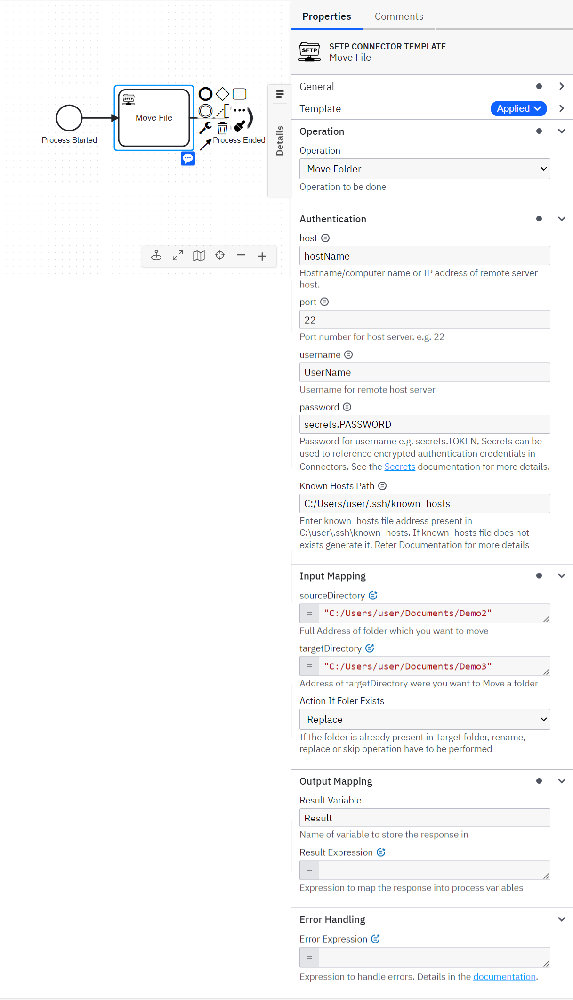

> **To Move Folder, take the following steps:**
1.	In the ***Operation** section*, set the field value *Operation* as **Move Folder**.
2.	Set the required parameters and credentials in the **Authentication** section.
3.	In the **Input Mapping** section, set the field **sourceDirectory**, **targetDirectory**, **Action if Folder Exists**".
4.	Set **sourceDirectory**, which is basically a path of folder which will be moved.
      e.g. ```C:/Users/user/Documents/sourceFolder/demoFolder```
5. Set **targetDirectory**, which is basically a path of folder where folder is going to moved. If it does not exists then connector will create a targetDirectory.
6. Set "Action If Folder Exists" as "rename", "replace" or "skip". This operations are performed when the folder is already exists in a target folder.
   </br> If **rename** is selected  then it will rename a folder.
   </br>  If **replace** is selected then it will replace a folder.
   </br> if **skip** is selected then it will skip this operation/folder.

> **Move File operation response**

You can use an output mapping to map the response:
-	Use **Result Variable** to store the response in a process variable.

## **Copy File**

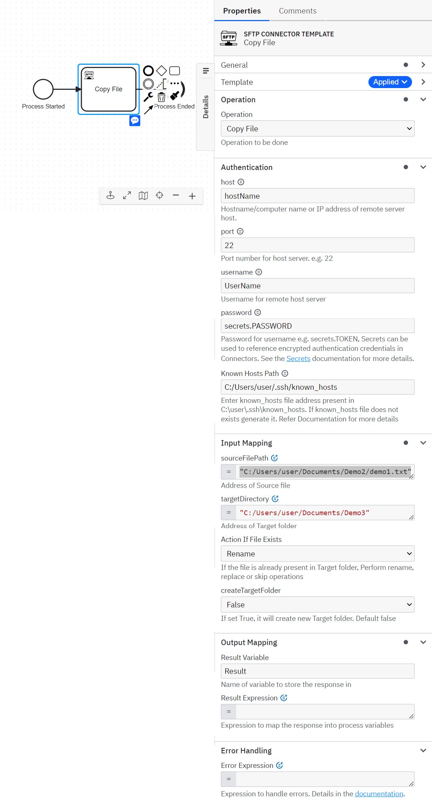

> **To Copy File, take the following steps:**
1.	In the ***Operation** section*, set the field value *Operation* as **Copy File**.
2.	Set the required parameters and credentials in the **Authentication** section.
3.	In the **Input Mapping** section, set the field **sourceFilePath**, **targetDirectory**, **Action if File Exists**".
4.	Set **sourceFilePath**, which is basically a path of file which will be copied. (Mention a file name with extension)
      e.g. ```C:/Users/user/Documents/sourceFolder/demo.txt```
5. Set **targetDirectory**, which is basically a path of folder where file is going to copied.
6. Set "Action If File Exists" as "rename", "replace" or "skip". This operations are performed when the file is already exists in a target folder.
   </br> If **rename** is selected  then it will rename a file.
   </br>  If **replace** is selected then it will replace a file.
   </br> if **skip** is selected then it will skip this operation/file.

> **Copy File operation response**

You can use an output mapping to map the response:
-	Use **Result Variable** to store the response in a process variable.

## **Copy Folder**

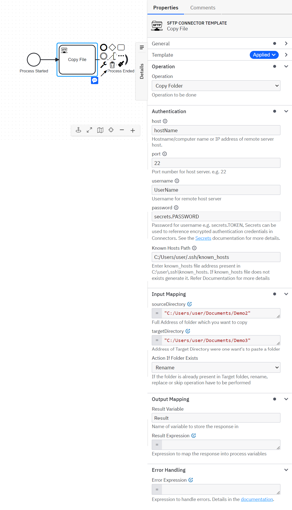

> **To Copy Folder, take the following steps:**
1.	In the ***Operation** section*, set the field value *Operation* as **Copy Folder**.
2.	Set the required parameters and credentials in the **Authentication** section.
3.	In the **Input Mapping** section, set the field **sourceDirectory**, **targetDirectory**, **Action if Folder Exists**".
4.	Set **sourceDirectory**, which is basically a path of folder which will be copied.
      e.g. ```C:/Users/user/Documents/sourceFolder/demoFolder```
5. Set **targetDirectory**, which is basically a path of folder where folder is going to copied. If it does not exists then connector will create a targetDirectory.
6. Set "Action If Folder Exists" as "rename", "replace" or "skip". This operations are performed when the folder is already exists in a target folder.
   </br> If **rename** is selected  then it will rename a folder.
   </br>  If **replace** is selected then it will replace a folder.
   </br>  if **skip** is selected then it will skip this operation/folder.

> **Move Folder operation response**

You can use an output mapping to map the response:
-	Use **Result Variable** to store the response in a process variable.

## **Delete File**

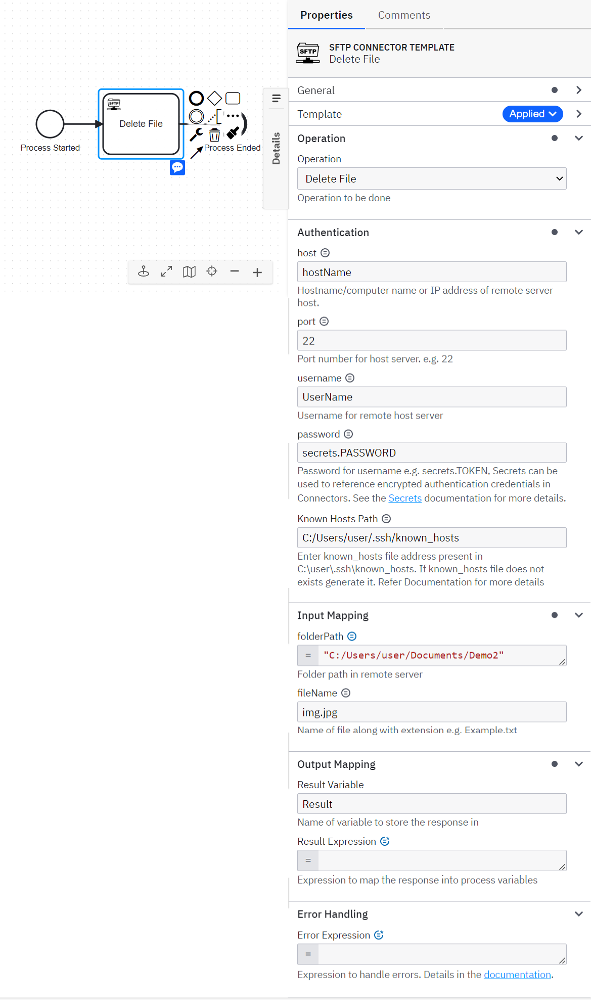

> **To Delete File, take the following steps:**
1.	In the ***Operation** section*, set the field value *Operation* as **Delete File**.
2.	Set the required parameters and credentials in the **Authentication** section.
3.	In the **Input Mapping** section, set the field **folderPath**, **fileName**.
4.	Set **folderPath**, which is basically a path of folder where a file resides.
      e.g. ```C:/Users/user/Documents/sourceFolder```
5. Set **fileName**, which is basically a name of file which is going to be deleted.
   e.g. ```demo.txt```

> **Delete File operation response**

You can use an output mapping to map the response:
-	Use **Result Variable** to store the response in a process variable.


## **Delete Folder**

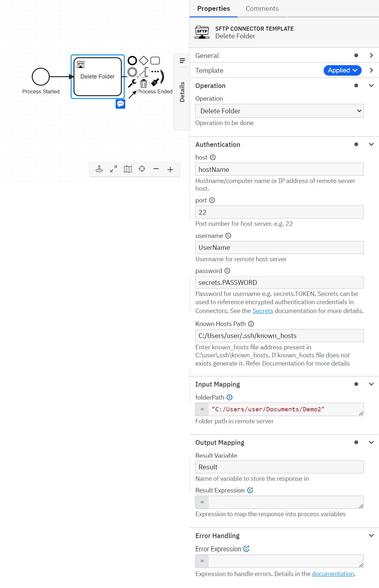

> **To Delete Folder, take the following steps:**
1.	In the ***Operation** section*, set the field value *Operation* as **Delete Folder**.
2.	Set the required parameters and credentials in the **Authentication** section.
3.	In the **Input Mapping** section, set the field **folderPath**.
4.	Set **folderPath**, which is basically a path of folder which is going to get deleted.
      e.g. ```C:/Users/user/Documents/sourceFolder```


> **Delete Folder operation response**

You can use an output mapping to map the response:
-	Use **Result Variable** to store the response in a process variable.


## **Create Folder**

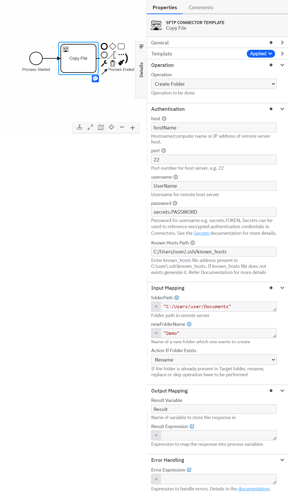

> **To Create Folder, take the following steps:**
1.	In the ***Operation** section*, set the field value *Operation* as **Create Folder**.
2.	Set the required parameters and credentials in the **Authentication** section.
3.	In the **Input Mapping** section, set the field **folderPath**, **newFolderName**, **Action If Folder Exists**.
4.	Set **folderPath**, which is basically a path of folder where a folder is going to be created
5. Set **newFolderName**, which is name of folder which is going to get created in **folderPath**
6. Set **Action If Folder Exists** as "rename", "replace" or "skip". This operations are performed when the folder is already exists in a target folder.
   </br> If **rename** is selected  then it will rename a folder.
   </br> If **replace** is selected then it will replace a folder.
   </br> if **skip** is selected then it will skip this operation/folder.

> **Create Folder operation response**

You can use an output mapping to map the response:
-	Use **Result Variable** to store the response in a process variable.


## **Read File**

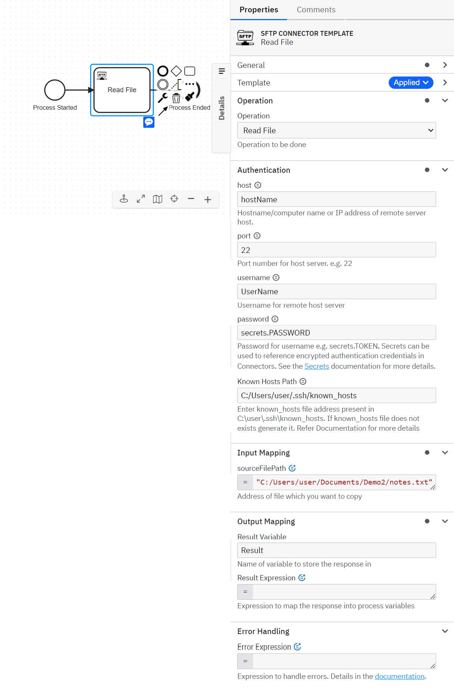

> **To Read File, take the following steps:**
1.	In the ***Operation** section*, set the field value *Operation* as **Read File**.
2.	Set the required parameters and credentials in the **Authentication** section.
3.	In the **Input Mapping** section, set the field **sourceFilePath**.
4.	Set **sourceFilePath**, which is basically a path of file which is going to get read. It is advisable to use those files which is readable like .txt file.
      e.g. ```C:/Users/user/Documents/sourceFolder/Demo.txt```


> **Read File operation response**

You can use an output mapping to map the response:
-	Use **Result Variable** to store the response in a process variable.

## **Write File**

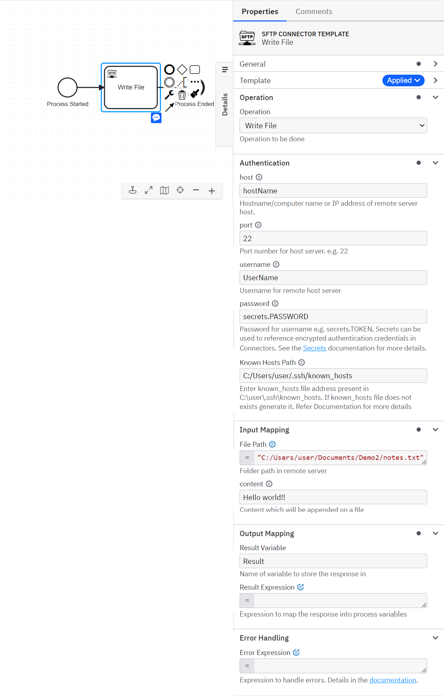

> **To Write File, take the following steps:**
1.	In the ***Operation** section*, set the field value *Operation* as **Write File**.
2.	Set the required parameters and credentials in the **Authentication** section.
3.	In the **Input Mapping** section, set the field **FilePath**, **Content**.
4.	Set **FilePath**, which is basically a path of file which is going to get written/append. It is advisable to use those files which is writable like .txt file.
      e.g. ```C:/Users/user/Documents/sourceFolder/Demo.txt```
5.  **Content** is the information/content which will be append in a "file".


> **Write File operation response**

You can use an output mapping to map the response:
-	Use **Result Variable** to store the response in a process variable.


# **Appendix & FAQ**

### **How can I authenticate SFTP Connector?**

The SMTP Connector needs the credentials for connection -
-	**host**- A hostname is a distinct name or label assigned to any device connected to a computer network, in this case its location server is hosted.
-	**portNumber**: Port Number of server
-	**username** and **password**: Username and password of user with required privilege.
- **known_hosts Path**: known_hosts file contains the public key of the SSH server which basically ensures that other server cannot  maliciously impersonate another server i.e. man-in-the-middle attacks. If you don't have this file one can easily generate it. For this one required OpenSSH Client


### **What is sortBy input parameter?**

sortBy input is a List of Map with keys – sortOn and order.

- **sortOn** – It can have values like - size, date, last accessed date, name.
- **order** – asc/ascending   OR   desc/descending
```json
[
    {
        "sortOn": "name",
        "order": "descending"
    }
]
```

 ```json
[
    {
        "sortOn": "size",
        "order": "asc"
    }
]
```
