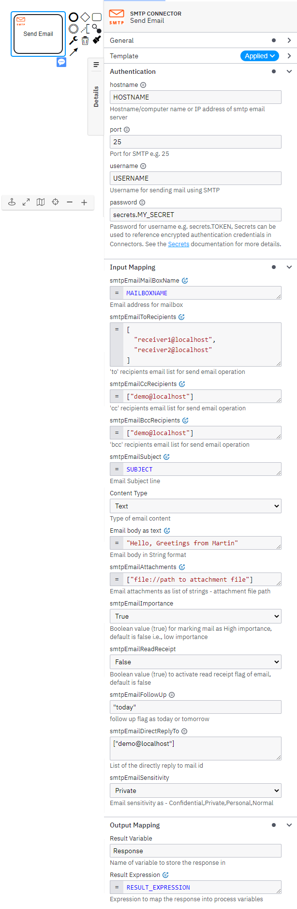

# Camunda SMTP Email Connector

Find the user documentation [here](#documentation)

## Build

```bash
mvn clean package
```

## API

### Input

##### Authentication Details

```json
{
  "authentication": {
    "hostname": "HOSTNAME",
    "port": "25",
    "username": "USERNAME",
    "password": "secrets.MY_SECRET"
  },
  "smtpEmailMailBoxName": "mailBoxName",
  "smtpEmailToRecipients": [
    "demo@localhost"
  ],
  "smtpEmailCcRecipients": [
    "demo@localhost"
  ],
  "smtpEmailBccRecipients": [
    "demo@localhost"
  ],
  "smtpEmailSubject": "subject",
  "smtpEmailContentType": "text",
  "smtpEmailContent": "Hello, world!",
  "smtpEmailAttachments": [
    "file://path to attachment file"
  ],
  "smtpEmailImportance": true,
  "smtpEmailReadReceipt": false,
  "smtpEmailFollowUp": "today",
  "smtpEmailDirectReplyTo": [
    "demo@localhost"
  ],
  "smtpEmailSensitivity": "Private"
}
```

### Output

```json
{
  "result": {
    "response": "....."
  }
}
```

## Test locally

Run unit tests

```bash
mvn clean verify
```

### Test as local Job Worker

Use
the [Camunda Connector Runtime](https://github.com/camunda-community-hub/spring-zeebe/tree/master/connector-runtime#building-connector-runtime-bundles)
to run your function as a local Job Worker.

See also the [:lock:Camunda Cloud Connector Run-Time](https://github.com/camunda/connector-runtime-cloud)

## Element Template

The element templates can be found in
the [smtp-email-connector.json](element-templates/smtp-email-connector.json) file.

# **Documentation**

The SMTP Connector allows you to send email using SMTP (Simple Mail Transfer Protocol) using template from your BPMN process.

### **Prerequisites**

To start working with the SMTP Connector, an email account must be created to a particular mailbox which acts as host for SMTP connection.  

*The following parameters are necessary for establishing smtp connection* - 

- **Hostname**: A hostname is a unique name or label assigned to any device connected to a computer network, in this case its location where email server is hosted. It enables us to establish an smtp connection by email server address through which email operations has to be implemented.
- **Port**: SMTP mailbox port number.
- **Username** & **Password**: These are the user credentials which enables the server to quickly identify the unique user for providing privileges.

### **Create an SMTP connector task**  

To use an SMTP Connector in your process, either change the type of existing task by clicking on it and using the wrench-shaped **Change type** context menu icon or create a new Connector task by using the **Append Connector** context menu. Follow our [guide on using Connectors](https://docs.camunda.io/docs/components/connectors/use-connectors/) to learn more.

## **Sending Emails through SMTP Connector**

To make the SMTP Connector executable, fill out the mandatory fields highlighted in red in the properties panel.

SMTP Connector server connection object **Authentication** takes – **host**, **port**, **username**, and **password**.  
e.g., *localhost*, *25*, *username*, *password* (as secrets Token e.g., secrets.MY_SECRET).

Firstly, we must initiate the task using BPMN diagram in either desktop modeler or web modeler.



### **Following are the further stages involved in the process:**

*Adding authentication details, input parameters involved in the process of email transfer from sender to receiver, output parameters and error parameters.*

#### **Authentication Details**:  
- Provide details related to hostname, port number, username and password.  
- As password is sensitive credential, use secrets token to store it internally and access it through secrets.MY_SECRET.
#### **Input Mapping**:  

1. **smtpEmailMailBoxName**:  
Mailbox name through which we are establishing smtp connection. `e.g., abc@domain.com`. It’s the source from where we want to send an email.

2. **smtpEmailToRecipients**:  
It's list of recipient email Ids. The email content will be sent to each recipient that is listed in this field. And It can’t be empty. It requires at least one recipient email id in the list.  
`e.g., [user1@hostname, user2@hostname, user3@hostname]`

3. **smtpEmailCcRecipients**:  
smtpEmailCcRecipients (Carbon Copy - CC), list of recipients who would receive a copy of the message. These email addresses will be visible to everyone who receives the message.  
`e.g., [user1@hostname, user2@hostname]`

4. **smtpEmailBccRecipients**:  
smtpEmailBccRecipients (Blind Carbon Copy - BCC), list of recipients who would receive a copy of the message. But, email addresses in the BCC field of a message, those addresses are invisible to the recipients of the email.  
`e.g., [user1@hostname, user2@hostname, user3@hostname]`

5. **smtpEmailSubject**:  
The smtpEmailSubject field corresponds to the subject(title) of the mail. The subject of an email depicts the purpose or overview of the email body.  
`e.g., “Request for an Appointment”, “Confirmation of Application Submission.”`

6. **Content Type**:  
It is email body type. It can be either **text** or **html**.  
*Text* is chosen if the mail body is in the form of manually typed textual content.   
And *html* is chosen if mail body contain is html code and user will provide a path to this html file.

7. **Body**:  
It is the actual message that will be sent from sender to receiver(s) over an established smtp connection through email server. The detailed representation of message is placed in this field.  

    >If content type is **text** - *body should be string*.  
    e.g., `"Hi, \n Greetings from Camunda Team!!"`  
    If content type is **html** - **provide path for html file ( which contains email body as html code)**.  
    e.g., `"D:/emailContent.html"`

8. **smtpEmailAttachments**:  
It is a ***list of file path for email attachments*** to be listed as part of the email for enabling reference related to the content provided in the corresponding email. It requires zero or more attachments.

9. **smtpEmailImportance**:  
The Importance marker enables the users to prioritize and categorize their emails based on whether emails are - **high importance** or **low importance**. It helps in marking importance label of the email.

10. **smtpEmailReadReceipt**:  
The Read Receipts feature enables the confirmation to the sender based on whether an email is opened by the recipient(s) or not. It is very helpful in tracking the delivery of the corresponding email and used to know whether it's successfully delivered and engaged with the recipient or not. The smtpEmailReadReceipt provides a drop-down menu and one can select true or false. Selecting “true” enables the read receipts tracking of the email delivery for the user and selecting “false” ( default ) just ignores this service.

12. **smtpEmailfollowUp**:  
The smtpFollowUp feature provides a follow-up flag. It provides a drop-down menu and we have to select whether it is today or tomorrow. Basically, It is a reminder message the one can send after the business virtual meetings, phone calls which can include thanking the others and providing them the contact and professional information.
It can also be sent to receiver of one’s previous email if there is no response from them for the previous mail. We must provide when it has to occurred and after the specified time follow up will get enabled.

13. **smtpEmailDirectReplyTo**:  
The smtpEmailDirectReplyTo field requires list of all email Ids to which the current email would have to be directly replied.

14. **smtpEmailSensitivity**:  
The smtpEmailSensitivity field provides a drop-down menu in which we must select one item where each one is **“confidential”, “personal”, “private”, “normal”**. The Sensitivity of an email corresponds to different categories such as Confidential, Personal, Private and Normal ( default ).
Through this we can enable the receiver(s) of an email treat the email message as corresponding sensitivity label. The receivers who receive the emails with private sensitivity label are unable to forward or redirect those emails as per their inbox rules.

### **Output Mapping**:
1. We maintain **Result variable** which stores the acknowledge message which tells the status of sending email through smtp connector as SUCCESS or FAIL.
2. We also maintain Result Expression in which we can declare new process variables that are used in the process engine from the Response Data of Result Variable.
### **Error Mapping**:
1. We maintain Error Expression in Error Mapping so that if there is any error occurred during sending the email through smtp connector, the error expression performed.
(e.g., bpmnError(“404”, “Error in Sending Mail!!”)).
2. We can make use of FEEL expressions to let Error expression act based on the kind of error it gets as below:

```json
If error.code == “404” then  
  bpmnError(“404”, “Got a 404 Error!!”)  
else if error.code == “500” then
  bpmnError(“500”, “Got a 500 Error!!”)
else
  null
```

<br>


# **Appendix & FAQ**

### **How can I authenticate my SMTP Connector?**  

The SMTP Connector needs the credentials for connection -  

**Hostname** (hostname) – of the server where email server is hosted,  
**Port** (port) – on which smtp server is accessible,  
**Username** (username) – User with proper privilege for operation and  
**Password** (password) – User password, which need to be saved as a Token in Secret vault and input can be provided as: secrets.TOKEN_NAME

### **What is smtpEmailReadReceipt input?**  

It is an email feature through which one can avail the confirmation about whether the email message has seen by recipient and whether the recipient opened the email or not. The accepted values are True/False.

### **What is smtpEmailSensitivity input?**  

The Sensitivity of an email corresponds to different categories such as **Confidential, Personal, Private and Normal**. Through this we can enable the receiver(s) of an email treat the email message as corresponding sensitivity label. The receivers who receive the emails with private sensitivity label are unable to forward or redirect those emails as per their inbox rules.

### **What are smtpEmailCcRecipients & smtpEmailBccRecipients?**  

smtpEmailCcRecipients (Carbon Copy) is a list of recipients who would receive a copy of the message. And these recipients are visible to everyone who receives the message.  
But for smtpEmailBccRecipients (Blind Carbon Copy), email addresses in the BCC field of a message would also receive a copy of the message. These addresses are invisible to the other recipients of the email.