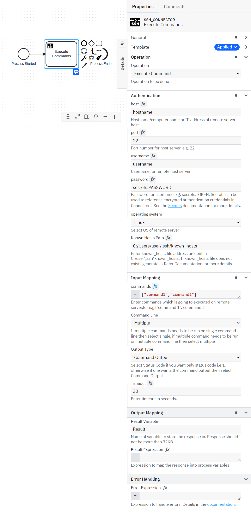

# Camunda SSH Connector

Find the user documentation [here](#documentation)

## Build

```bash
mvn clean package
```

## API

### Input

##### Authentication Details

```json
  {
  "authentication": {
    "hostname": "Hostname",
    "portNumber": "22",
    "username": "Username",
    "password": "Password",
    "knownHostsPath": "C:/Users/user/.ssh/known_hosts",
    "operatingSystem": "windows"
  },
  "operation": "ssh.executeCommand",
  "data": {
  }
}
```

#### Input for Execute Commands

```json
{
  "authentication": {
    "hostname": "Hostname",
    "portNumber": "22",
    "username": "Username",
    "password": "Password"       ,
    "knownHostsPath":"C:/Users/user/.ssh/known_hosts",
    "operatingSystem":"windows"
  },
  "operation": "ssh.executeCommand",
  "data": {
    "commands":["dir","ipconfig","hostname"],
    "commandLine":"multiple",
    "outputType":"statusCode",
    "timeout":"10"
  }
}
```


> **commands** is list of commands which are going to execute on linux/windows server </br>
> **commandLine** can be single or multiple depending on the use case. Single should be selected when  multiple commands are need to execute sequentially otherwise multiple should be selected. If commands are not depend on each other so it is highly recommanded to select Multiple for quick debugging of errors</br>
> **outputType** can be statusCode or commandOutput. If commandOutput is selected then output will be the list of map of command and its output on command line and for statusCode it will be 1  </br>
> **timeout** One can apply the timeout in seconds on the commands. Currently, this feature works more accurately for linux then windows</br>


### Output

```json
{
  "result": {
    "response": "....."
  }
}
```

## Test locally

Run unit tests

```bash
mvn clean verify
```

### Test as local Job Worker

Use
the [Camunda Connector Runtime](https://github.com/camunda-community-hub/spring-zeebe/tree/master/connector-runtime#building-connector-runtime-bundles)
to run your function as a local Job Worker.

See also the [:lock:Camunda Cloud Connector Run-Time](https://github.com/camunda/connector-runtime-cloud)

## Element Template

The element templates can be found in
the [ssh-connector-template.json](./element-templates/ssh-connector-template.json) file.

# **Documentation**

**SSH** – *Secure Socket Shell Protocol* is a network protocol that gives users, particularly system administrators, a secure way to access a computer over an unsecured network
</br>
The SSH Connector is developed to execute non-interactive commands on remote server(windows/linux).


### **Prerequisites**

To start working with the SSH Connector. user need a server details like - host, portNumber, username, password,known_hosts path.

*The following parameters are necessary for establishing connection* -

-	**host**- A hostname is a distinct name or label assigned to any device connected to a computer network, in this case its location where server is hosted.
-	**portNumber**: Port Number of server(default is 22)
-	**username** and **password**: Username and password of user with required privilege.
-	**known_hosts Path**: known_hosts file contains the public key of the SSH server which basically ensures that other server cannot  maliciously impersonate another server i.e. man-in-the-middle attacks. If you don't have this file one can easily generate it. For this one required OpenSSH Client. To generate the file use command </br>
  ```ssh-keyscan server_name >> destination_path ```
- **operatingSystem:** Operating system of remote server.

### **Creating SSH connector task**

Currently, the SSH Connector supports only single type of operation which is Execute Command.

To use a SSh Connector in your process, either change the type of existing task by clicking on it and using the wrench-shaped **Change type** context menu icon or create a new Connector task by using the **Append Connector** context menu. Follow our [guide on using Connectors](https://docs.camunda.io/docs/components/connectors/use-connectors/) to learn more.

### **Making SSH Connector executable**

To make the SSH Connector executable, fill out the mandatory fields highlighted in red in the properties panel.

### **Authentication for SSH Connector**

SSH Connector authentication object takes – **host**, **portNumber**, **username** and **password** *(as secrets Token i.e. secrets.Token)*, **KnownHostsPath**, **operatingSystem**.


## **Execute Commands**



> **To Execute Commands, take the following steps:**
1.	In the ***Operation** section*, set the field value *Operation* as **Execute Commands**.
2.	Set the required parameters and credentials in the **Authentication** section.
3.	In the **Input Mapping** section, set the field commands, commandLine, outputType, timeout.
4. **commands** is list of commands which are going to execute on linux/windows server </br>
5. **commandLine** can be single or multiple depending on the use case. Single should be selected when  multiple commands are need to execute sequentially otherwise multiple should be selected. If commands are not depend on each other, then it is highly recommended to select **Multiple** for quick debugging of errors</br>
6. **outputType** can be statusCode or commandOutput. If commandOutput is selected then output will be the list of map of command and its output on command line and for statusCode it will be 1  </br>
7. **timeout** One can apply the timeout in seconds on the commands. **Currently, the timeout is more accurately works on linux then windows**</br>
<br>

> **Execute Commands operation response**

You can use an output mapping to map the response:
- Use **Result Variable** to store the response in a process variable. Response is based on what one selects in outputType i.e. statusCode or commandOutput.
</br>
1. **statusCode** - If command get successfully executed then it will return 1.
2. **commandOutput** - List of maps of command and its output on commandLine if commandLine is multiple. If commandLine is single it will be concatenation of output of all the commands which are executing sequentially.


# **Appendix & FAQ**

### **How can I authenticate SSH Connector?**

The SSH Connector needs the credentials for connection -
-	**host**- A hostname is a distinct name or label assigned to any device connected to a computer network, in this case its location server is hosted.
-	**portNumber**: Port Number of server
-	**username** and **password**: Username and password of user with required privilege.
- **known_hosts Path**: known_hosts file contains the public key of the SSH server which basically ensures that other server cannot  maliciously impersonate another server i.e. man-in-the-middle attacks. If you don't have this file one can easily generate it. For this one required OpenSSH Client
- **operatingSystem:** Operating System of remote server
